[TOC]


# 一.Java开发环境


## 1.1 计算机基础知识

### 1.1.1   计算机

计算机（Computer）全称：电子计算机，俗称电脑。是一种能够按照程序运行，自动、高速处理数据的现代化智能电子设备。由硬件和软件所组成，没有安装任何软件的计算机称为裸机。常见的形式有台式计算机、笔记本计算机。按照规模分为微型机、小型机、大型机、巨型机（超级计算机）等。

计算机的应用已渗透到社会的各个领域，正在改变着人们的工作、学习和生活的方式，推动着社会的发展。哪些方面?


### 1.1.2   计算机硬件

**计算机硬件**（Computer Hardware）是指计算机系统中由电子，机械和光电元件等组成的各种物理装置的总称。这些物理装置按系统结构的要求构成一个有机整体为计算机软件运行提供物质基础。

计算机通常由CPU、主板、内存、电源、主机箱、硬盘、显卡、键盘、鼠标，显示器等多个部件组成。


### 1.1.3   计算机软件

**计算机软件**（Computer Software）是使用计算机过程中必不可少的东西，计算机软件可以使计算机按照事先预定好的顺序完成特定的功能，计算机软件按照其功能划分为系统软件与应用软件

**系统软件：** DOS(Disk Operating System), Windows, Linux, Unix, Mac, Android, iOS

**应用软件：**office QQ 英雄联盟 王者荣耀


### 1.1.4   软件开发

**软件**

按照特定顺序组织的计算机数据和指令的集合

**开发**

软件的制作过程

**软件开发**

借助开发工具与计算机语言制作软件


### 1.1.5   计算机语言

**语言**

人类进行沟通交流的各种表达符号，方便人与人之间进行沟通与信息交换

**计算机语言**

人与计算机之间进行信息交流沟通的一种特殊语言

计算机语言中也有字符，符号等等

常见的计算机语言如C,C++,C#,JAVA


### 1.1.6   人机交互方式

软件的出现实现了人与计算机之间更好的交互。

交互方式

图形化界面：这种方式简单直观，使用者易于接受，容易上手操作。

命令行方式：需要有一个控制台，输入特定的指令，让计算机完成一些操作。较为麻烦，需要记录住一些命令。


### 1.1.7   键盘功能键及快捷键介绍

Tab             Shift  		 Ctrl 		Alt		空格    Enter

Window

上下左右

PrtSc(PrintScreen)屏幕截图

Ctrl+A  全选

Ctrl+C  复制

Ctrl+V  粘贴

Ctrl+X  剪切

Ctrl+Z  撤销

Ctrl+S  保存…


### 1.1.8   常用的DOS命令

打开DOS控制台的方式  Windows+R

常用DOS命令

cmd 进入DOS窗口            #快捷方式，浏览目录，直接输入CMD跳转

默认是在c盘下，可以切换盘符。

e:  进入e盘

dir 列出当前目录下的目录和文件

mkdir  新建文件夹

rmdir  删除文件夹

cd java 进入java目录

cd .. 退到上层目录

cd / 退到根目录

exit : 退出dos命令行

cls : (clear screen)清屏


## 1.2 Java语言概述

https://www.tiobe.com/tiobe-index/ TIOBE语言热度排行榜


### 1.2.1   Java语言发展史

**詹姆斯·高斯林**（James Gosling）1977年获得了加拿大卡尔加里大 学计算机科学学士学位，1983年   获得了美国卡内基梅隆大学计算机科学博士学位，毕业后到IBM工作，设计IBM第一代工作站NeWS系统，但不受重视。

后来转至Sun公司，1990年，与Patrick，Naughton和Mike Sheridan等人合作“绿色计划”，后来发展一套语言叫做“Oak”，后改名为Java。

Java Development Kit

1.0 - 1.1  -  1.2 -  1.3  -  1.4  - 1.5

5.0  -  6.0  -  7.0  -  8.0…..

Sun公司于1995年推出

| 1991年        | sun公司James Gosling等人开始开发Oak语言        |
| ------------- | ---------------------------------------------- |
| 1994年        | 将Oak语言更名为Java                            |
| 1996年        | 获得第一笔投资1亿元                            |
| 1998年        | 提出jdk1.2，更名为java2  之后推出jdk1.3 jdk1.4 |
| 2005年        | 更名为jdk5.0，进行了大幅的版本改进             |
| 2006年        | sun公司宣布将Java作为免费软件对外发布          |
| 2007年3月起   | 全世界所有的开发人员均可对Java源代码进行修改   |
| 2007年        | 推出jdk6.0                                     |
| 2009年4月     | Oracle以74亿美元收购了sun公司                  |
| 2011年7月     | 由Oracle正式发布jdk7                           |
| **2014年3月** | **正式发布了java8**                            |

### 1.2.2   Java语言平台版本

**J2SE**(Java 2 Platform Standard Edition)标准版

是为开发普通桌面和商务应用程序提供的解决方案，该技术体系是其他两者的基础，可以完成一些桌面应用程序的开发。

**J2ME**(Java 2 Platform Micro Edition)小型版

是为开发移动设备和嵌入式设备(电器、机器人、机顶盒…)提供的解决方案。

**J2EE**(Java 2 Platform Enterprise Edition)企业版

是为开发企业环境下的应用程序提供的一套解决方案，该技术体系中包含的技术如 Servlet、Jsp等，主要针对于Web应用程序开发。

### 1.2.3   Java语言特点

- 简单性

- 高性能

- 编译性         

- 解释性

- 面向对象      

- 分布式处理     

- 健壮性

-  安全性

- 开源      

- **跨平台**

- 什么是跨平台性？

  ​    通过Java语言编写的应用程序在不同的系统平台上都可以运行。

  原理是什么？

  只要在需要运行java应用程序的操作系统上，先安装一个Java虚拟机(JVM Java Virtual Machine)即可。由JVM来负责Java程序在该系统中的运行。

  因为有了JVM，所以同一个Java程序在三个不同的操作系统中都可以执行。这样就实现了Java程序的跨平台性。也称为Java具有良好的可移植性。

  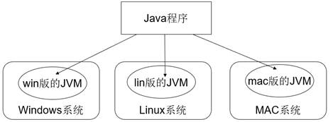

## 1.3 JDK

### 1.3.1   概述

JDK是 Java 语言的软件开发工具包，主要用于移动设备、嵌入式设备上的java应用程序。JDK是整个java开发的核心。

它包含了:

1、  JAVA开发工具(jdk\bin)

2、  基础开发库(jdk\jre\lib\rt.jar)

3、  基础开发库的源码(jdk\src.zip)

### 1.3.2   下载与安装

通过官方网站获取JDK：http://www.oracle.com

也可以通过百度自行搜索资源。

下载完后进行安装，傻瓜式安装，下一步下一步即可。

注意：

1、 同时安装多个jdk时需要使用指定环境变量来确认使用的是哪个jdk

2、 安装路径不要有中文或者特殊符号如空格等。最好目录统一

3、 我们也提供了绿色解压版，不需要安装直接解压即可

## JRE和JDK的区别

**JRE(Java Runtime Enviroment)****是Java的运行环境**。面向Java程序的使用者，而不是开发者。如果你仅下载并安装了JRE，那么你的系统只能运行Java程序。JRE是运行Java程序所必须环境的集合，包含JVM标准实现及 Java核心类库。它包括Java虚拟机、Java平台核心类和支持文件。它不包含开发工具(编译器、调试器等)。

**JDK(Java Development Kit)**又称J2SDK(Java2 Software Development Kit)，是Java开发工具包，它提供了Java的开发环境(提供了编译器javac等工具，用于将java文件编译为class文件)和运行环境(提 供了JVM和Runtime辅助包，用于解析class文件使其得到运行)。如果你下载并安装了JDK，那么你不仅可以开发Java程序，也同时拥有了运 行Java程序的平台。JDK是整个Java的核心，包括了Java运行环境(JRE)，一堆Java工具tools.jar和Java标准类库 (rt.jar)。

如果我们想要运行一个已有的Java程序，只需要安装jre即可；

如果我们想要开发一个全新的Java程序，则必须安装jdk。


jdk-jre-jvm的包含关系如下：

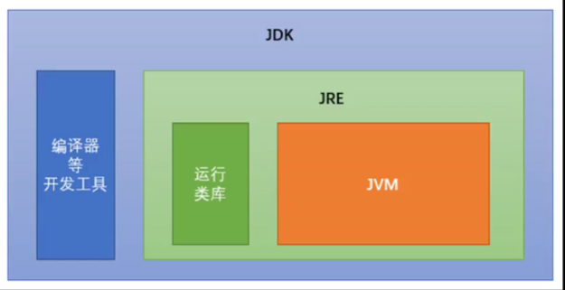

### 1.3.3   配置环境变量

#### JAVA_HOME

该配置是要配置jdk的安装目录，来明确要使用哪个版本的jdk。

例如：我把jdk安装在了D:\Java\jdk8。配置如下：


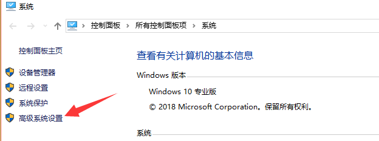

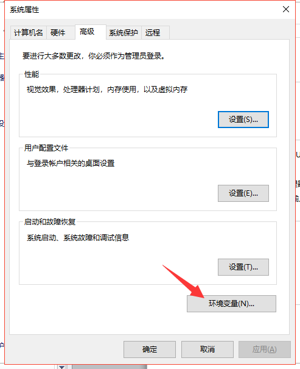

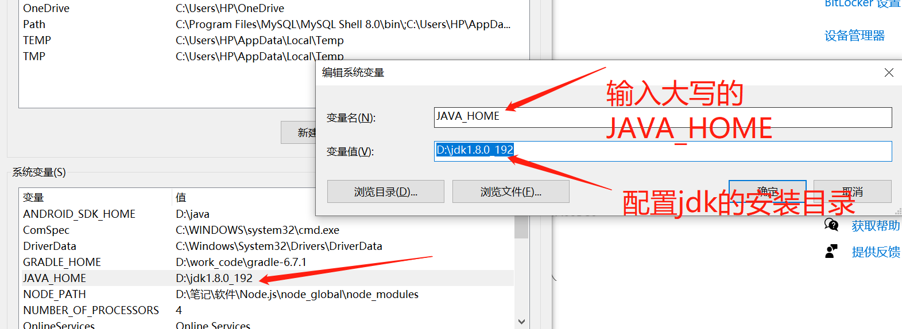

#### PATH

系统会在path配置的值中，寻找可执行文件。

需要把jdk\bin添加到path中。

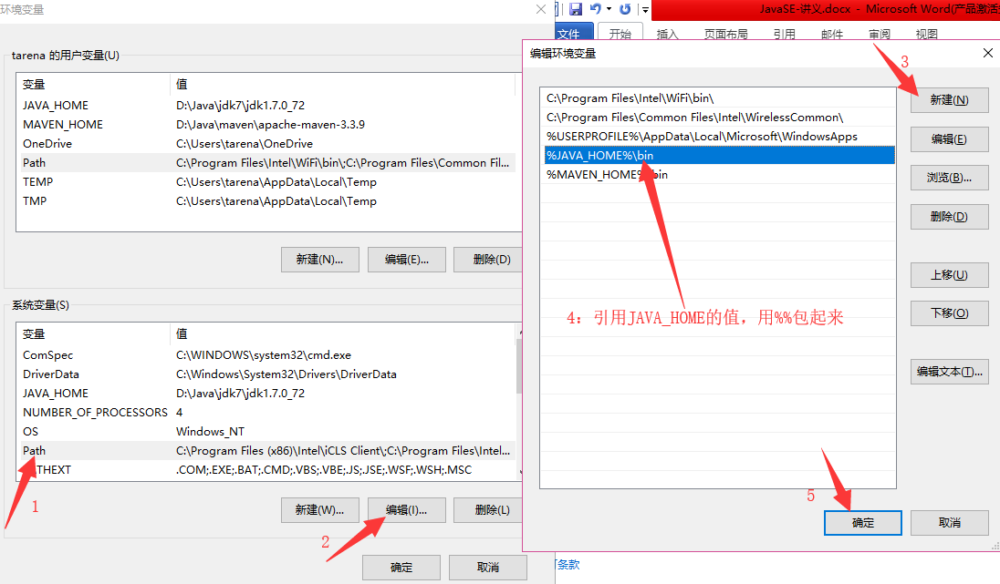

### 1.3.4   目录介绍

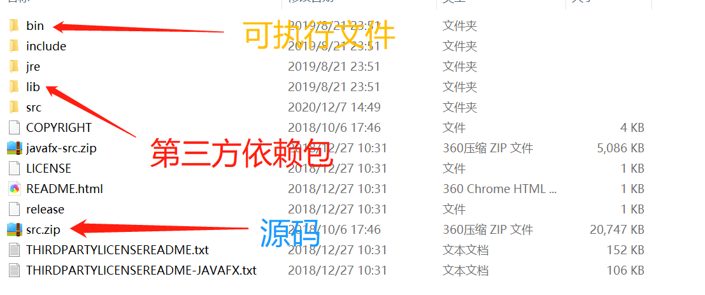

### 1.3.5	检测是否安装配置好JDK

windows+R 输入cmd，再输入命令java -version ，出现一下界面说明已经配置成功

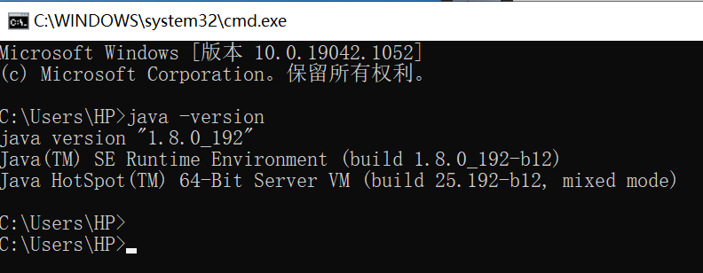


# 二.HelloWorld的开发与运行

## 2.1	程序的开发与说明

Java程序开发分为三个步骤：**编写，编译，运行**。


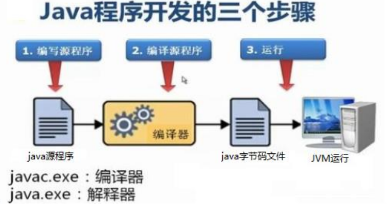

## 2.2 	编写Java源程序

1. 在磁盘中创建文件，文件名为HelloWorld，后缀必须为java.
2. 在文件中编写代码并保存：

```
public class HelloWorld {
	public static void main(String[] args) {
		System.out.println("Hello World");
	}
}
```

第一个HelloWorld源程序就编写完成了，，但是这个文件是程序员编写的，Jvm看不懂，也就不能运行，因此我们必须要将编写好的Java文件编写成Jvm看得懂的字节码文件。        

## 

## 2.3	编译Java源文件

在DOS命令行中，进入到Java源文件的目录中，使用javac的命令进行编译：

```
javac java源文件.后缀名
```

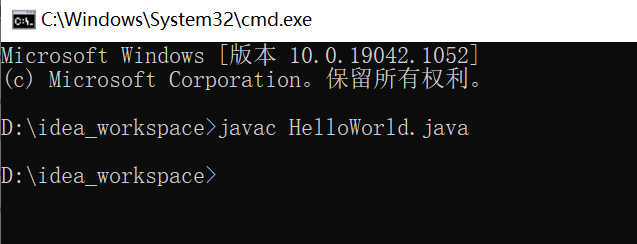


编译成功后，命令没有任何的提示，只是在源文件目录多了一个HelloWorld.class的文件，这个就是Java可以运行的文件，称为**字节码文件**，字节码文件就可以实现Java的跨平台性。

```
编译Java源文件的工具为javac.exe，在jdk安装目录下的bin目录下。
```

## 2.4	运行Java文件

运行方式：

```
java 类名
```

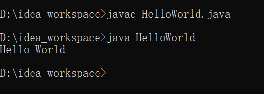

```
运行字节码文件的工具为java.exe，在JDK安装目录下的bin目录下.
```

## 2.5	HelloWorld说明

```
//单行注释
/* 多行注释 */

/*
 * 用来定义一个类
 * public  是关键字，专门用来修饰类的访问权限。公共的
 * class   是关键字，专门用来定义一个类
 * HelloWorld 类名 -- 驼峰命名法
 * {   java代码   }
 */

public class HelloWorld {

    /*
     *  定义一个主函数/主方法/main方法
     * public  是关键字，专门用来修饰main方法的访问权限。公共的
     * static  是关键字，修饰main方法是静态方法
     * void    空/无，main方法返回值是空
     * main    方法名
     * ()  是方法的标志
     * String[] args 方法的参数
     * {  Java代码/方法体   }
     */
     
    public static void main(String[] args) {
    
       /*
        *  用来向控制台输出指定的数据
        * System  要发出系统指令
        * out     发出一个输出的动作
        * println 打印后换行
        * ()  是方法的标志
        * "hello java"  方法的参数 -- 要输出的数据
        * ;  Java语句的结束符
        */ 

       System.out.println("hello java");

    }
}
```

## 2.6	编译和运行的区别


- **编译**：指将我们写好的Java源文件翻译成JVM认识的class文件，javac编译器会检查我们的程序是否有错，有则提示，没有则编译成功；
- **运行**：指将class字节码文件，交给JVM去运行。 

**main方法说明**：Java类中的主方法，写法固定，不能更改。main方法是整个Java程序的入口，JVM运行字节码文件都会先找main方法，再运行我们编写的代码。

## 2.7	标识符，关键字，变量和常量

- **标识符**：可以简单的理解为是一个名字，在Java中我们需要标志代码的很多元素，包括类名，方法名，字段，变量等。标识符应遵循以下规则：
  1. 标识符可以由字母，下划线，数字，美元（$）组成，但不能包含@,%，空格等其他特殊符号；
  2. 不能以数字开头；
  3. 标识符应严格区分大小写；
  4. 标识符的命名最好能反应其作用，做到见名知义。
  5. 类名规范：首字母大写，后面的每个单词首字母大写（大驼峰式）；
  6. 方法名规范：首字母小写，后面每个单词的首字母大写（小驼峰式）；
  7. 变量名规范：全部小写。
- **关键字**:在Java中已经被赋予特定含义的单词，一共由53个，其中有两个保留字:const和goto。关键字不能被用作标识符。

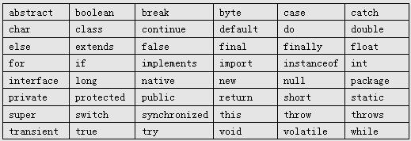

- **变量**：在JAVA中，有的数据值是不固定的，总在变，我们还需要记录这些值，我们可以把这些值理解为变量。

  我们通过三个元素来描述变量：变量类型，变量名以及变量值。

  int age=18;  //声明int类型的变量并赋值

  String tel; //声明String类型的变量

  注意：

  1、 变量名必须是一个有效的标识符。

  2、 变量名不可以使用java关键字

  3、 变量名不能重复

- **常量**：在程序运行中不会被改变的量。常量名一般需要大写。


# 三.IntelliJ-IDEA的安装与使用

**IDEA官方下载地址：https://www.jetbrains.com/idea/download/#section=windows**

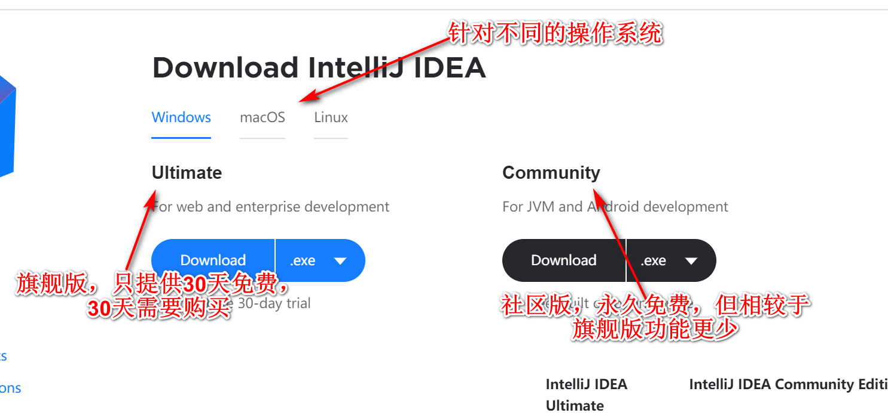

**IDEA创建项目的等级结构划分**

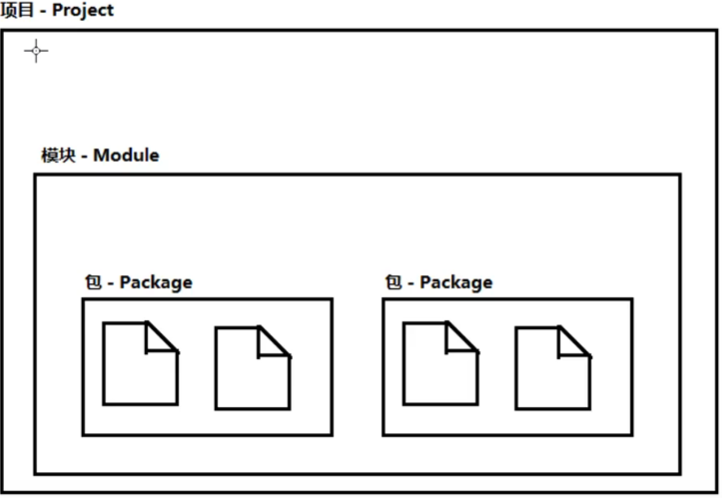

创建java类的步骤:

1. 创建java Project;
2. 创建包--包名小写，一般为公司域名倒写；
3. 创建java类

**IDEA常用设置：**

- 设置字体：File-Settings-Editor-Font
- 代码自动补全：File-Settings-Keymap-设置default copy-Main menu-Code-Completion-Basic双击remove,再双击Add Keyboard Shortcut改成自己熟悉的，一般为Alt+/

**IDEA常用快捷键：**

| 快捷键             | 功能                               |
| ------------------ | ---------------------------------- |
| Alt+Enter          | 导入包，自动修正代码               |
| Ctrl+V             | 删除光标所在行                     |
| Ctrl+D             | 复制光标所在行的内容，插入光标下面 |
| Ctrl+Alt+L         | 格式化代码                         |
| Ctrl+/             | 单行注释，再次按为取消注释         |
| Ctrl+Shift+/       | 多行注释，再按取消注释             |
| Alt+Shift+上下箭头 | 移动当前行                         |
| Alt+Insert         | 快速生成get,set,toString方法       |


# 四.数据类型

## 3.1	基本类型（8种）

### 3.1.1	八大基本类型介绍

位bit  	字节byte	 1byte = 8bit

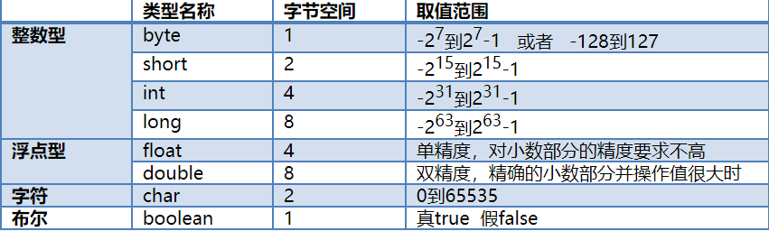

**变量的定义三个要素：数据类型，变量名，变量值**

格式：

```
数据类型 变量名 = 变量值;
int a = 10;
```

### 3.1.2	练习

#### 3.1.2.1	练习一：8大基本类型的赋值

```
public class Variable {
public static void main(String[] args){
//定义字节型变量
byte b = 100;
System.out.println(b);
//定义短整型变量
short s = 1000;
System.out.println(s);
//定义整型变量
int i = 123456;
System.out.println(i);
//定义长整型变量
long l = 12345678900L;
System.out.println(l);
//定义单精度浮点型变量
float f = 5.5F;
System.out.println(f);
//定义双精度浮点型变量
double d = 8.5;
System.out.println(d);
//定义布尔型变量
boolean bool = false;
System.out.println(bool);
//定义字符型变量
char c = 'A';
System.out.println(c);
}
}
```

#### 3.1.2.2	8大基本类型的最大值和最小值

```
public class Test1 {

       public static void main(String[] args){             
              //=====1、整型测试开始
              byte a=-128;
              byte b=127;             
              short c=Short.MIN_VALUE;
              short d=Short.MAX_VALUE;             
              int e=Integer.MIN_VALUE;
              int f=Integer.MAX_VALUE;            
              long g=Long.MIN_VALUE;
              long h=Long.MAX_VALUE;             
              System.out.println(a);
              System.out.println(b);
              System.out.println(c);
              System.out.println(d);
              System.out.println(e);
              System.out.println(f);
              System.out.println(g);
              System.out.println(h);
              //=====整型测试结束         
              //=====浮点测试开始
              float i=Float.MIN_VALUE;
              float j=Float.MAX_VALUE;           
              double k=Double.MIN_VALUE
              double l=Double.MAX_VALUE;
              System.out.println(i);
              System.out.println(j);
              System.out.println(k);
              System.out.println(l);
              //=====浮点测试结束        
              //=====字符测试开始
			  char a='a';
              char b=97;
              char c='b';
              char d=98;
              System.out.println(a);
              System.out.println(b);
              System.out.println(c);
              System.out.println(d);
              //=====字符测试结束
       }
}
```

## 3.2	注意事项

- 变量名称：在同一个大括号范围内，变量的名字不可以相同；

- 变量赋值：定义的变量，不赋值不能使用；

- 对于创建的Long和Float类型的数据，字母后缀L和F不能丢掉；

- 变量的使用不能超过作用域范围

  【作用域】：从定义的变量一行开始，一直到所属的大括号结束。


# 五.数据类型的转换

Java程序中要求参与的计算的数据，必须要保证数据类型的一致性，如果数据类型不一致，将发生数据类型的转换。

## 4.1	小转大--隐式转换（自动转换）

```
Byte a = 120;
int b = a;
```

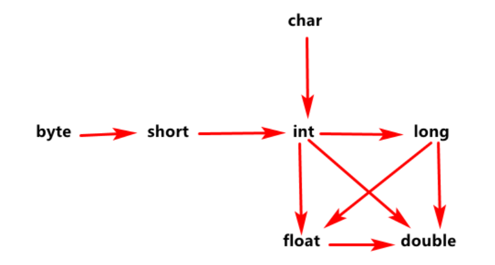

## 4.2	大转小--显示转换（强制转换）

```
int a = 365;
byte b = (byte)a; // 需要强制转换
```

**注意：**小数转成整数，小数直接舍弃。

## 4.3	运算规则（5条）

### 4.3.1	计算结果的数据类型，与最大类型一致

```
3 / 2 = 1; //结果需与int保持一致
3d / 2 = 1.5; // 相当于double/int,结果为double类型
```

### 4.3.2	byte,short,char三种比int小的整数，运算时会自动转换成int

```
byte a=3;
byte b=4;
byte c=a+b;//错，运行时，byte会先自动转成int再运算，int+int还是int
```

### 4.3.3	整数运算溢出

```
计算：光速运行一年的长度是多少米
System.out.println(300000000*60*60*24*365);
System.out.println(300000000l*60*60*24*365);
```

### 4.3.4	浮点数运算不准确

```
System.out.println(1-0.8);
System.out.println(4.35*100);
// Java提供了解决方案，后面会讲到
```

### 4.3.5	浮点数的特殊值

```
Infinity 无穷大  3.14/0 
Nan  not a number  0/0.0
```

**注意：char类型在做运算操作时，有时得到的可能不是你想要的结果**

```
char a = 'A';
System.out.println(a + 1); // 66 也就是大写字母A被当作65来处理
// 计算机的底层会用一个数字（二进制）来代替字符A，就是65
// 一旦char类型在做数学运算时，那么字符就会按照一定的规则翻译成一个数字-这就是ASCII
```

**ASCII码表((American Standard Code for Information Interchange): 美国信息交换标准代码）是基于拉丁字母的一套电脑编码系统，主要用于显示现代英语和其他西欧语言。它是最通用的信息交换标准，并等同于国际标准ISO/IEC 646。其实就是字符和数字的对应表**。

**ASCII码表只针对于美国的信息交换，那么其他国家的字符交换怎么办呢？这个时候我们就需要使用另外一个码表--Unicode码表--万国码表。0-127和ASCII码表相同，但是从128开始就包含了更多的字符（中文，韩文，日文，Emoji图像等）**

```
char zifu = '中';
System.out.println(zifu + 0);// 20013
```


# 六.运算符

## 6.1	算术运算符

| 算术运算符 | 含义                 |
| ---------- | -------------------- |
| +          | 加法运算，字符串连接 |
| -          | 减法运算             |
| *          | 乘法运算             |
| /          | 除法运算             |
| %          | 取模运算             |
| ++、--     | 自增自减运算         |

- **在Java的整数运算中，使用以上运算符，无论怎么计算都不会产生小数**

```
public static void main(String[] args) {
	int a = 100;
	System.out.println(a / 10 * 10);
}
```

- **++ 运算，变量自己增长1；反之,--运算，变量自己减少1，用法和++一样**

  单独使用：不和其他操作混合，自己独立成为一个步骤；

  混合使用：和其他操作混合；

  **区别**：

  1. 在单独使用时，++a和a++效果一样；
  2. 混合使用时：
     - **如果++在前，那么变量先+1,再拿着结果使用；**---先变化后使用
     - **如果++在后，那么先使用变量本来的值，再让变量+1**。---先使用再变化

```
public static void main(String[] args) {
	//	单独使用
	int a = 100;
	System.out.println(a++);
	System.out.println(++a);
	System.out.println(a--);
	System.out.println(--a);
	
	// 混合使用
	int b = 10;
	System.out.println(++b);// 11
	System.out.println(b);// 11
	
	int c = 20;
	System.out.println(c++); // 20
	System.out.println(c); // 21
}
```

## 6.2	赋值运算

| 赋值运算符 | 含义   |
| ---------- | ------ |
| =          | 等于号 |
| +=         | 加等于 |
| -=         | 减等于 |
| *=         | 乘等于 |
| /=         | 除等于 |
| %=         | 取模等 |

**赋值运算就是将右边的值，赋给左边的变量**

```
public static void main(String[] args) {
	int a = 100;
	a += 5;
	System.out.println(a);// 105
}
```

 **a=a+4和a+=4的区别**

```
      byte a = 1;
//     a=(byte) (a+4);//右侧int，左侧byte，大转小，强转。
//     a=(byte) (a+4);//右侧int，左侧byte，大转小，强转。
       a+=4;//会自动完成数据类型的转换 
       //注意：a=a+4和a+=4是有区别的！！
       System.out.println(a);
```

## 6.3	比较运算符

| 比较运算符 | 含义                                                         |
| ---------- | ------------------------------------------------------------ |
| ==         | 比较符号两边的数据是否相等，相等为true,不相等为false         |
| <          | 比较符号左边的数据是否小于右边的数据，小于为true，大于为false |
| >          | 比较符号左边的数据是否大于右边的数据，大于为true，小于为false |
| <=         | 比较符号左边的数据是否小于或等于右边的数据，小于或等于为true，大于为false |
| >=         | 比较符号左边的数据是否大于或等于右边的数据，大于或等于为true，大于为false |
| !=         | 不等于，两边数值不相等则为true                               |

## 6.4	逻辑运算符

逻辑运算符只能用于布尔值

| 逻辑运算符 | 含义                                                         |
| ---------- | ------------------------------------------------------------ |
| &          | 与，两边结果同为真结果才为真                                 |
| &&         | 短路与，两边结果同为真才为真。特点：只要左边为假，则不需要计算右边的结果 |
| \|         | 或，两边只要一个结果为真，就为真                             |
| \|\|       | 短路或，两边只要一个结果为真，就为真。特点：只要左边为真，右边就不用运算 |
| !          | 非，对变量取反                                               |

```
public static void main(String[] args) {

	System.out.println(true && true);//true
    System.out.println(true && false);//false
    System.out.println(false && true);//false，右边不计算
    System.out.println(false || false);//falase
    System.out.println(false || true);//true
    System.out.println(true || false);//true，右边不计算
    System.out.println(!false);//true
}
```

## 6.5	三元运算符

- **格式**

```
数据类型 变量名 = 布尔表达式 ? 结果1 : 结果2;
```

- **计算方式**

```
布尔表达式的结果为true，将结果1赋值给变量；
布尔表达式的结果为false,将结果2赋值给变量。
```

```
public static void main(String[] args) {
    int i = (1==2 ? 100 : 200);
    System.out.println(i);//200
    int j = (3<=4 ? 500 : 600);
    System.out.println(j);//500
}

```

**练习1：判断平年闰年**

```
/*
输入年号，判断是否是闰年。两个条件：
1、能被4整除，并且不能被100整除
2、或者能被400整除
*/
import java.util.Scanner;
public class Test1 {
       public static void main(String[] args) {
              System.out.println("年号：");
              int y = new Scanner(System.in).nextInt();         
              String r="平年";
              if(y%4==0){
                     if(y%100!=0){
                            r="闰年";
                     }
              }
              if(y%400==0){
                     r="闰年";
              }
或者
 
	if((y%4==0&&y%100!=0)||y%400==0){
                     r="闰年";
              }
              System.out.println(y+"年是"+r);
       }
}
```


**练习2：求3个数的最大值：**

```
import java.util.Scanner;
public class Test1_三个数的最大值 {
       public static void main(String[] args) {             
              System.out.println("整数a:");
              int a = new Scanner(System.in).nextInt();           
              System.out.println("整数b:");
              int b = new Scanner(System.in).nextInt();
              System.out.println("整数c:");
              int c = new Scanner(System.in).nextInt();
                int max = a>b?a:b;
                  max=max>c?max:c;
                或者
			  int max = a>b?(a>c?a:c):(b>c?b:c);
              System.out.println(max);
       }
}
```

# 七.方法

## 7.1	方法概述

就是将一个功能抽取出来，把代码单独定义在大括号中，形成一个单独的功能。当我们需要这个功能时，就去调用这个方法。这样即实现了代码的复用，又解决了代码的冗余。

## 7.2	方法的定义

- 定义格式：

```
修饰符 返回值类型 方法名(参数) {
	代码;
	return;
}
```

- 定义格式解释

  - 修饰符：目前固定写法 public static;
  - 返回值类型：目前固定写法为 void ,之后还可能接触到String,Integer,对象等返回值;
  - 方法名：我们自定义的方法名字，遵循标识符的命名规则，用来调用方法；
  - 参数列表：目前没有参数；
  - return:方法结束的返回，目前为void，表示没有返回值，方法内的return可以不写。

  ```
  public static void methodName() {
  	System.out.println("这是一个方法。");
  }
  ```

  
  
  ## 7.3	方法的调用
  
  方法在定义好后是不会执行的，必须被调用才能执行，我们可以在主方法main中来调用我们自己定义好的方法，在主方法中直接写方法的名字就可以调用了。
  
  ```
  public static void main(String[] args) {
  //调用定义的方法method
  method();
  }
  //定义方法，被main方法调用
  public static void method() {
  System.out.println("自己定义的方法，需要被main调用运行");
  }
  ```


## 7.4	调用练习

**练习1：将三元运算符代码抽取到自定义方法中，并调用。**

```
public static void main(String[] args) {
//调用定义的方法operator
operator();
}
//定义方法，方法中定义三元运算符
public static void operator() {
int i = 0;
i = (1==2 ? 100:200);
System.out.println(i);
int j = 0 ;
j = (3<=4 ? 500:600);
System.out.println(j);
}
```

**练习2：方法参数**

```
public class Test1_参数 {
       public static void main(String[] args) { 
                     System.out.println(1);
                     f(2);
                     System.out.println(2);
              }
       static void f(int x){
              System.out.println(x*x);//142
       }
}
```

**练习3：方法返回值**

```
public class tt {
       public static void main(String[] args) {
              System.out.println(1);
              int num=f3(5);
              System.out.println(num);
	          String str = f4("学习使我快乐");
              System.out.println(str);
              System.out.println(2);
       }
       public static String f4(String desc){
              return desc+",我信你个鬼";
       }

       public static int f3(int i){
       
              return i*10;
       }
}
```

## 7.5	方法的重载

### 7.5.1	 概念

**方法重载是指在一个类中定义多个同名的方法，但要求每个方法具有不同的参数列表(也就是说参数的个数和类型不同)。**

**程序调用方法时，可以通过传递给它们的不同个数和类型的参数来决定具体使用哪个方法。**

### 7.5.2	 练习1：数字求和

```
public class Test5_方法重载 {
       public static void main(String[] args) {
              int a=10;
              int b=20;

              f1();
              f1(a);
              f1(a,b);
              f1(a,b,name);
       }

       private static void f1(int a, int b, String name) {
              System.out.println(a+b+name);//30name
       }

       private static void f1() {
              System.out.println("f1()");

       }

       private static void f1(int a) {
              System.out.println(a);

       }

       private static void f1(int a, int b) {
              System.out.println(a+b);

       }     
}
```


## 7.6	注意事项

- 方法定义的注意事项：
  - 方法必须定义在一类中方法外；
  - 方法不能定义在另一个方法里面。


# 八.分支，循环结构--流程控制

## 8.1	分支结构--if

### 8.1.1	概述

顺序结构的程序虽然能解决计算，输出等问题，但是不能做判断选择。对于要判断再选择的问题，就要使用分支结构。

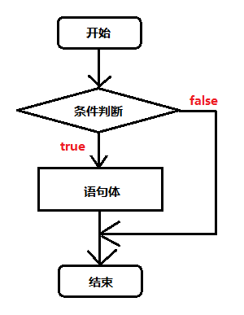

### 8.1.2	格式

```
单分支：

if(判断条件){

       代码。。。

}

多分支：

if(判断条件){

       代码1。。。

}else{

       代码2。。。

}

嵌套分支：

if(判断条件1){

       代码1。。。

}else if(条件2){

       代码2。。。

} else if(判断条件3){

       代码3。。。

}else{

       代码4。。。

}
```


### 8.1.3	练习1：商品打折

```
import java.util.Scanner;

public class ttt {

       public static void main(String[] args) {
       
              System.out.println("输入总原价");             
              double price = new Scanner(System.in).nextDouble();
              double now = f(price);
              System.out.println(now);
       }     
       public static double f(double p){
             
              if(p>5000){
                     p=p*0.5;
              }else
                  if(p>2000){
                         p=p*0.8;
              }else if(p>1000){
                     p=p*0.9;
              }             
              return p;
       }     
}
```

### 8.1.4	练习2：统计学生得分

要求：90分以上 优秀

​			80~89 良好

​			70~79 中等

​			60~69 及格

​			60分以下 不及格

```
import java.util.Scanner;

public class aa {

    public static void main(String[] args) {
    
       double score = new Scanner(System.in).nextDouble();
       if (score >= 100 || score <= 0) {
           System.out.println("请输入0~100以内的值");
       }
       if (score > 90 && score <= 100) {
           System.out.println("优秀");
       } else if (score >= 80 && score <= 90) {
           System.out.println("良好");
       } else if (score >= 70 && score <= 79) {
           System.out.println("中等");
       } else if (score >= 60 && score <= 69) {
           System.out.println("及格");
       }else if (score < 60) {
           System.out.println("不及格");
       }
    }
}
```

## 8.2	分支结构--switch

### 8.2.1	概述

当一个case成立，从这个case向后穿透所有的case，包括default，直到程序结束或者遇到break结束。

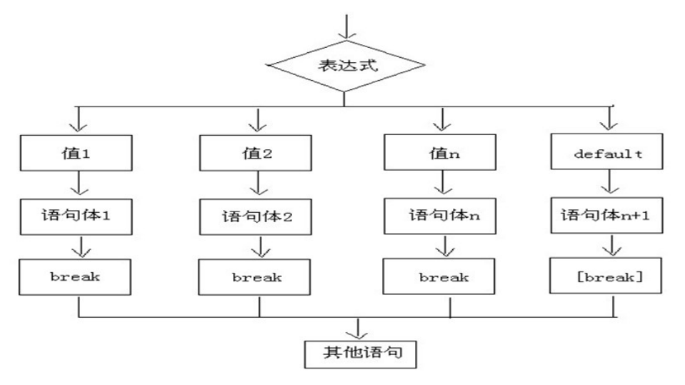

- 执行流程 
  - 首先计算出表达式的值 ；
  - 其次，和case依次比较，一旦有对应的值，就会执行相应的语句，在执行的过程中，遇到break就会结 束；
  -  最后，如果所有的case都和表达式的值不匹配，就会执行default语句体部分，然后程序结束掉。

### 8.2.2	格式

switch(expr1)中,expr1是一个整数表达式， 整数表达式可以是int基本类型或Integer包装类型,由于byte,short,char都可以隐含转换为int，所以也支持。

注意： jdk1.7以后新增 String

```
switch(变量或者表达式){

       case 1:

       case 2:

       case 3:  

	case 4:  
       default:
}
```

### 8.2.3	练习：数字匹配

```
import java.util.Scanner;
 
public class Test1_数字匹配 {

       public static void main(String[] args) {
            
              int i=3;
              switch (i) {
              case 1:
                     System.out.println("1");
                     break;
                     
              case 2:
                     System.out.println("2");
                     break;
                     
              case 3:
                     System.out.println("3");
//                  break;

              default:
                     System.out.println("default");
                     break;
              }
            
       }

}
```

## 8.3	循环结构--for

### 8.3.1	概述

循环结构是指在程序中需要反复执行某个功能而设置的一种程序结构。

它由循环体中的条件，判断继续执行某个功能还是退出循环。

根据判断条件,循环结构又可细分为先判断后执行的循环结构和先执行后判断的循环结构。


- 执行流程：
  - 执行顺序：①②③④>②③④>②③④…②不满足为止。
  - 执行顺序：①②③④>②③④>②③④…②不满足为止。
  - 执行顺序：①②③④>②③④>②③④…②不满足为止。
  - ③具体执行的语句。
  - ④循环后，循环条件所涉及变量的变化情况。

### 8.3.2	格式

```
for(开始条件1；循环条件2；更改条件4){
       循环体代码3…
}
```

### 8.3.3	练习1：从0打印到10

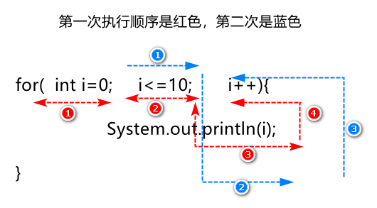

```
public class ttttt {

       public static void main(String[] args) {

              f1();
       }
       public static void f1(){
              for (int i = 0; i <= 10; i++) {
                     System.out.print(i);
              }
       }     
}
```

### 8.3.4	练习2：从10打印到0

```
public class ttttt {

       public static void main(String[] args) {
              f2();
       }
       
       public static void f2(){
              for(int i=10;i>=0;i--){
                     System.out.print(i);
              }     
       }
}
```

### 8.3.5	练习3：打印8，88，888，8888

```
public class ttttt {

       public static void main(String[] args) {
              f();
       }
       
       public static void f(){
              for(int i=8;i<=10000;i=i*10+8){
                     System.out.println(i);
              }
       }
}
```

### 8.3.6	练习4：求【0，100】中奇数的个数

### 8.3.7	练习5：求【0，100】中偶数的和


## 8.4	嵌套for循环

### 8.4.1	概述

根据外层的条件，判断里层能否执行，如果能执行，就把里层代码都循环完毕后，再继续执行外层，继续判断。

### 8.4.2	格式

```
for(…){
       for(…){             
	}
}
```

### 8.4.3	入门案例

```
public class T {

       public static void main(String[] args) {
//           f1();
              f2();
       }
       //总结1：当i=1时，j取到了所有满足条件的数据，1,2,3,4,5。
       //也就是说外循环执行1次，内循环执行多次
       private static void f1() {
              for(int i=1;i<=3;i++){//外循环
                     System.out.println("i="+i);//1,2,3
                     for(int j=1;j<=5;j++){//内循环
                            System.out.println("j="+j);//1,2,3,4,5
                     }
              }
       } 
//总结2：外循环控制行，内循环控制列
       private static void f2() {
              for(int i=1;i<=3;i++){
                     for(int j=1;j<=5;j++){
                            System.out.print("*");
                     }
                     System.out.println();
              }
       } 
}
```

### 8.4.4	练习1：打印正方形

```
//正方形

for(int i=1;i<5;i++){
       for(int j=1;j<5;j++){
              System.out.print("*");
       }
       System.out.println();
}     
```

### 8.4.5	练习2：打印99乘法表

```
//99乘法表
private static void f4() {
       for (int i = 1; i < 9; i++) {//外循环，控制行，是一定的
              for (int j = 1; j <= i; j++) {//内循环，列是不固定的，是递增的
                     System.out.print(i+"*"+j+"="+i*j+" ");//保证第一行打印出来一个*，注意条件
              }
              System.out.println();
       }
}
```


## 8.5	循环结构--while

### 8.5.1	格式

```
初始化表达式①
while(布尔表达式②){
循环体③
步进表达式④
}
```

- 执行流程
  - 初始化表达式① while(布尔表达式②){ 循环体③ 步进表达式④ 
  - ①负责完成循环变量初始化
  - ②负责判断是否满足循环条件，不满足则跳出循环
  - ③具体执行的语句
  - ④循环后，循环变量的变化情况。


### 8.5.2	练习1：输出10次HelloWorld

```
public static void main(String[] args) {
        //while循环实现打印10次HelloWorld
        //定义初始化变量
        int i = 1;
        //循环条件<=10
        while(i<=10){
        System.out.println("HelloWorld");
        //步进
        i++;
	}
}

```

### 8.5.3	练习2：计算1-100之间的和

```
public static void main(String[] args) {
    //使用while循环实现
    //定义一个变量,记录累加求和
    int sum = 0;
    //定义初始化表达式
    int i = 1;
    //使用while循环让初始化表达式的值变化
    while(i<=100){
    //累加求和
    sum += i ;
    //步进表达式改变变量的值
    i++;
  }
    //打印求和的变量
    System.out.println("1‐100的和是："+sum);
}
```

## 8.6	循环结构--do...while

### 8.6.1	格式

```
初始化表达式①
do{
    循环体③
    步进表达式④
}while(布尔表达式②);
```

- 执行流程：
  - 执行顺序：①③④>②③④>②③④…②不满足为止
  - ①负责完成循环变量初始化
  - ②负责判断是否满足循环条件，不满足则跳出循环
  - ③具体执行的语句
  - ④循环后，循环变量的变化情况

**do...while循环的特点：无条件执行一次循环体，即使我们将循环条件直接写成false，也依然会循环一次。这样的 循环具有一定的风险性，因此初学者不建议使用do...while循环。**

```
public static void main(String[] args){
    do{
    System.out.println("无条件执行一次");
    }while(false);
}
```


### 8.6.3     练习1：输出10次HelloWorld

```
public static void main(String[] args) {
    int x=1;
    do {
    System.out.println("HelloWorld");
    x++;
    }while(x<=10);
}
```


**for循环和while循环的区别：**

1. 控制条件语句所控制的那个变量，在for循环结束后，就不能再被访问到了，而while循环结束还可以继 续使用，如果你想继续使用，就用while，否则推荐使用for。原因是for循环结束，该变量就从内存中消 失，能够提高内存的使用效率。
2. 在已知循环次数的时候使用推荐使用for，循环次数未知的时推荐使用while。


## 8.7	死循环

也就是循环中的条件永远为true，死循环的是永不结束的循环。例如：while(true){}；

在后期的开发中，会出现使用死循环的场景，例如：我们需要读取用户输入的输入，但是用户输入多少数据我们并 不清楚，也只能使用死循环，当用户不想输入数据了，就可以结束循环了，如何去结束一个死循环呢，就需要使用 到跳出语句了。


## 8.8	跳出语句

### 8.8.1	break

**使用场景：终止switch或者循环**

- 使用场景：终止switch或者循环；在循环语句中；离开使用场景的存在是没有意义的。

```
public static void main(String[] args) {
        for (int i = 1; i<=10; i++) {
        //需求:打印完两次HelloWorld之后结束循环
        if(i == 3){
        break;
        }
        System.out.println("HelloWorld"+i);
	}
}

```

### 8.8.2	continue

- 使用场景：结束本次循环，继续下一次的循环

```
public static void main(String[] args) {
        for (int i = 1; i <= 10; i++) {
        //需求:不打印第三次HelloWorld
        if(i == 3){
        continue;
        }
        System.out.println("HelloWorld"+i);
     }
}
```

