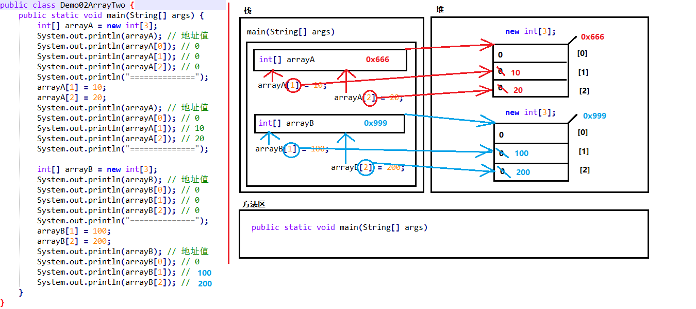
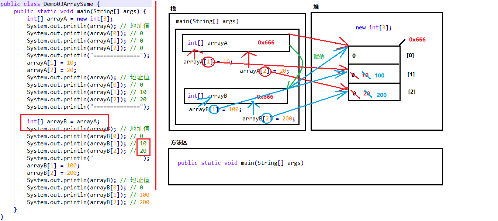

# 九.数组

## 9.1.容器概述


### 9.1.1.**案例分析**

现在需要统计某公司员工的工资情况，例如计算平均工资、找到最高工资等。假设该公司有50名员工，用前面所学 的知识，程序首先需要声明50个变量来分别记住每位员工的工资，然后在进行操作，这样做会显得很麻烦，而且错 误率也会很高。因此我们可以使用容器进行操作。将所有的数据全部存储到一个容器中，统一操作。


### 9.1.2.**容器的概念**

**是将多个数据存储到一起，每个数据称为该容器的元素。**


## 9.2.数组

### 9.2.1.数组的概念

**数组就是存储数据长度固定的容器，保证多个数据的数据类型要一致。**

### 9.2.2.数组的定义

#### 方式一：

- 格式：

```
数组存储的数据类型[] 数组名字 = new 数组存储的数据类型[长度];
```

- 数组定义的详解：
  - 数组存储的数据类型： 创建的数组容器可以存储什么数据类型。
  - [] : 表示数组。
  - 数组名字：为定义的数组起个变量名，满足标识符规范，可以使用名字操作数组。
  - new：关键字，创建数组使用的关键字。
  - 数组存储的数据类型： 创建的数组容器可以存储什么数据类型。
  - [长度]：数组的长度，表示数组容器中可以存储多少个元素。
  - 注意：数组有定长特性，长度一旦指定，不可更改。
- 举例：定义可以存储3个整数的数组容器，代码如下：

```
int[] arr = new int[3];
```

#### 方式二：

- 格式：

```
数据类型[] 数组名 = {元素1,元素2,元素3...};
```

- 举例：定义存储1，2，3，4，5整数的数组容器

```
int[] arr = {1,2,3,4,5};
```

####   方式三：

- 格式：

```
数据类型[] 数组名 = {元素1,元素2,元素3...};
```

- 举例：定义存储1，2，3，4，5整数的数组容器

```
int[] arr = {1,2,3,4,5};
```

## 9.3.数组的访问方式

- **索引：**： 每一个存储到数组的元素，都会自动的拥有一个编号，从0开始，这个自动编号称为**数组索引 (index)**，可以通过数组的索引访问到数组中的元素。
- **格式：**

```
数组名[索引]
```

- **数组的长度属性：**每个数组都具有长度，而且是固定的，Java中赋予了数组的一个属性，可以获取到数组的 长度，语句为： 数组名.length ，属性length的执行结果是数组的长度，int类型结果。由次可以推断出，数 组的最大索引值为 数组名.length-1 。


```
public static void main(String[] args) {
    int[] arr = new int[]{1,2,3,4,5};
    //打印数组的属性，输出结果是5
    System.out.println(arr.length);
}
```

- **索引访问数组中的元素：**
  - 数组名[索引]=数值，为数组中的元素赋值
  - 变量=数组名[索引]，获取出数组中的元素

```
public static void main(String[] args) {
    //定义存储int类型数组，赋值元素1，2，3，4，5
    int[] arr = {1,2,3,4,5};
    //为0索引元素赋值为6
    arr[0] = 6;
    //获取数组0索引上的元素
    int i = arr[0];
    System.out.println(i);
    //直接输出数组0索引元素
    System.out.println(arr[0]);
}
```

#### 9.3.1.练习：创建100以内随机数组

```
import java.util.Arrays;

import java.util.Random;

public class t {
       public static void main(String[] args) {
              f();
       }
       private static void f() {
              int[] a = new int[5];
              for (int i = 0; i < a.length; i++) {

                     a[i]=1+new Random().nextInt(100);
              }
              System.out.println(Arrays.toString(a));
       }
}
```


# 十.数组的内存原理

## 10.1.内存概述

​	内存是计算机中的重要原件，临时存储区域，作用是运行程序。我们编写的程序是存放在硬盘中的，在硬盘中的程 序是不会运行的，必须放进内存中才能运行，运行完毕后会清空内存。

 Java虚拟机要运行程序，必须要对内存进行空间的分配和管理。

## 10.2.Java虚拟机的内存划分

为了提高运算效率，就对空间进行了不同区域的划分，因为每一片区域都有特定的处理数据方式和内存管理方式。

| **区域名称** | **作用**                                          |
| ------------ | ------------------------------------------------- |
| 方法栈       | 方法运行时使用的内存，比如main方法进入方法栈运行  |
| 堆内存       | 存储对象或者数组，new来创建的，都存储在堆内存。   |
| 方法区       | 存储可以运行的.class文件                          |
| 本地方法栈   | JVM在使用操作系统功能的时候使用，和我们开发无关。 |
| 寄存器       | 给CPU使用                                         |


## 10.3.数组在内存中的存储

### 10.3.1.一个数组的内存

```
public static void main(String[] args) {
    int[] arr = new int[3];
    System.out.println(arr);//[I@5f150435
}
```

以上方法执行，输出的结果是[I@5f150435，这个是什么呢？是数组在内存中的地址。new出来的内容，都是在堆 内存中存储的，而方法中的变量arr保存的是数组的地址。

输出arr[0]，就会输出arr保存的内存地址中数组中0索引上的元素


### 10.3.2.两个数组的内存

```
public static void main(String[] args) {
    int[] arr = new int[3];
    int[] arr2 = new int[2];
    System.out.println(arr);
    System.out.println(arr2);
}

```



### 10.3.3.两个变量指向一个数组

```
public static void main(String[] args) {
    // 定义数组，存储3个元素
    int[] arr = new int[3];
    //数组索引进行赋值
    arr[0] = 5;
    arr[1] = 6;
    arr[2] = 7;
    //输出3个索引上的元素值
    System.out.println(arr[0]);
    System.out.println(arr[1]);
    System.out.println(arr[2]);
    //定义数组变量arr2，将arr的地址赋值给arr2
    int[] arr2 = arr;
    arr2[1] = 9;
    System.out.println(arr[1]);
}
```



# 十一.数组的常见操作

## 11.1.数组的越界异常

​	创建数组，赋值3个元素，数组的索引就是0，1，2，没有3索引，因此我们不能访问数组中不存在的索引，程序运 行后，将会抛出 ArrayIndexOutOfBoundsException 数组越界异常。在开发中，数组的越界异常是不能出现的，一 旦出现了，就必须要修改我们编写的代码。

```
public static void main(String[] args) {
    int[] arr = {1,2,3};
    System.out.println(arr[3]);
}
```


## 11.2.数组的空指针异常

​	arr = null 这行代码，意味着变量arr将不会在保存数组的内存地址，也就不允许再操作数组了，因此运行的时候 会抛出 NullPointerException 空指针异常。在开发中，数组的越界异常是不能出现的，一旦出现了，就必须要修 改我们编写的代码。

```
public static void main(String[] args) {
    int[] arr = {1,2,3};
    arr = null;
    System.out.println(arr[0]);
｝
```


## 11.3.数组的遍历(重点)

**数组遍历：就是将数组中的每一元素分别取出来。**遍历是数组操作中最基本的要求。

```
public static void main(String[] args) {
    int[] arr = { 1, 2, 3, 4, 5 };
    System.out.println(arr[0]);
    System.out.println(arr[1]);
    System.out.println(arr[2]);
    System.out.println(arr[3]);
    System.out.println(arr[4]);
}
```

​	以上代码是可以将数组中每个元素全部遍历出来，但是如果数组元素非常多，这种写法肯定不行，因此我们需要改 造成循环的写法。数组的索引是 0 到 lenght-1 ，可以作为循环的条件出现。

```
public static void main(String[] args) {
    int[] arr = { 1, 2, 3, 4, 5 };
    for (int i = 0; i < arr.length; i++) {
    System.out.println(arr[i]);
    }
}
```

## 11.4.数组的最大元素

- **最大值获取：**从数组中的所有元素取出最大值。
- 实现思路：
  - 定义变量，保存数组0索引上的元素
  - 遍历数组，获取出数组中的每个元素
  -  将遍历到的元素和保存数组0索引上值的变量进行比较
  - 如果数组元素的值大于了变量的值，变量记录住新的值
  - 数组循环遍历结束，变量保存的就是数组中的最大值


```
public static void main(String[] args) {
    int[] arr = { 5, 15, 2000, 10000, 100, 4000 };
    //定义变量，保存数组中0索引的元素
    int max = arr[0];
    //遍历数组，取出每个元素
    for (int i = 0; i < arr.length; i++) {
    //遍历到的元素和变量max比较
    //如果数组元素大于max
    if (arr[i] > max) {
    //max记录住大值
    max = arr[i];
    	}
    }
    System.out.println("数组最大值是： " + max);
}
```

##      11.5.数组的反转

- **数组的反转**： 数组中的元素颠倒顺序，例如原始数组为1,2,3,4,5，反转后的数组为5,4,3,2,1

- **实现思想**：数组最远端的元素互换位置。

  - 实现反转，就需要将数组最远端元素位置交换
  - 定义两个变量，保存数组的最小索引和最大索引
  - 两个索引上的元素交换位置
  - 最小索引++，最大索引--，再次交换位置
  - 最小索引超过了最大索引，数组反转操作结束

  

```
public static void main(String[] args) {
    int[] arr = { 1, 2, 3, 4, 5 };
    /*
    循环中定义变量min=0最小索引
    max=arr.length‐1最大索引
    min++,max‐‐
    */
    for (int min = 0, max = arr.length ‐ 1; min <= max; min++, max‐‐) {
        //利用第三方变量完成数组中的元素交换
        int temp = arr[min];
        arr[min] = arr[max];
        arr[max] = temp;
    }
        // 反转后，遍历数组
        for (int i = 0; i < arr.length; i++) {
        System.out.println(arr[i]);
    }
}
```

## 11.6.案例分析

### 11.6.1.分析以下代码，计算输出结果

```
public static void main(String[] args) {
    int a = 1;
    int b = 2;
    System.out.println(a);
    System.out.println(b);
    change(a, b);
    System.out.println(a);
    System.out.println(b);
}
    public static void change(int a, int b) {
    a = a + b;
    b = b + a;
}
```

### 11.6.2.分析以下代码，计算输出结果

```
public static void main(String[] args) {
    int[] arr = {1,3,5};
    System.out.println(arr[0]);
    change(arr);
    System.out.println(arr[0]);
}
    public static void change(int[] arr) {
    arr[0] = 200;
}

```

**总结：方法的参数为基本类型时，传递的是数据值，方法的参数是引用类型时，传递的是地址值。**


# 十二.数组的工具类Arrays

## 12.1.Arrays.toString(arr)

把数组里的数据，用逗号连接成一个字符串。

格式：[10, 14, 20, 46, 51]


## 12.2.Arrays.sort(arr)

对数组排序，对于基本类型的数组使用优化后的快速排序算法，效率高。

对引用类型数组，使用优化后的合并排序算法。


## 12.3.Arrays.copyOf(arr)

把数组复制成一个指定长度的新数组。

新数组长度大于原数组，相当于复制，并增加位置。--数组的扩容

新数组长度小于原数组，相当于截取前一部分数据。--数组的缩容


## 12.4.练习

```
int[] a = Arrays.copyOf(arr, 10);//数组的复制，大于原来长度相当于扩容

System.out.println(Arrays.toString(a));//[12, 30, 20, 90, 34, 0, 0, 0, 0, 0]

System.out.println(a.length);//10       

int[] a2 = Arrays.copyOf(arr, 3);//数组的复制，晓宇原来长度相当于截取前几个数据

System.out.println(Arrays.toString(a2));//[12, 30, 20]

System.out.println(a2.length);//10
```

## 12.5.拓展

### 12.5.1.了解二维数组

存放数组的数组，也就是说数组里存的还是数组的数据形式。


### 12.5.2.了解冒泡排序


```
import java.util.Arrays;

import java.util.Random;

public class TT {

       public static void main(String[] args) {
              int[] arr = new int[]{43, 36, 45, 18, 24,9,20,32};
              int[] arrnew = f1(arr);
              System.out.println(Arrays.toString(arrnew));

       }

       private static int[] f1(int[] a) {

              //外循环控制循环次数，如果5个数字，循环4次就行

              for (int i = 0; i < a.length-1; i++) {

                     //内循环控制比大小，循环次数和外循环一样

                     for (int j = 0; j < a.length-1; j++) {

                            if(a[j]>a[j+1]){
                                   int t = a[j];
                                   a[j]=a[j+1];
                                   a[j+1]=t;
                            }
                     }
              }
              return a;
       }
```

### 12.5.3.了解其他算法

如：合并算法，二分算法，快速算法等，冒泡最常见，也是面试中出现率最高的
