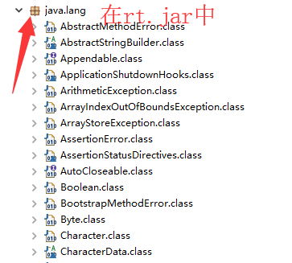
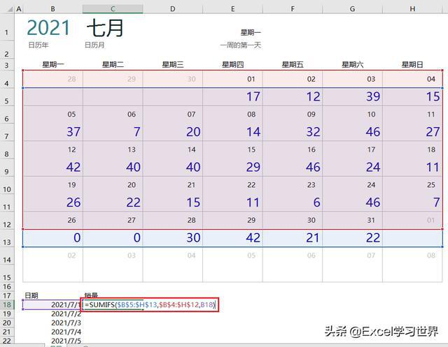

# 异常和内部类及部分常用API


# 一.异常

## 1.概述

用来封装错误信息的对象。

组成结构：类型，提示，行号。

## 2.异常的继承结构

```
Throwable - 顶级父类
	-- Error：系统错误，无法修复
	-- Exception：可修复的错误
		--RunTimeException
			--ClassCastException
			--ClassNotFoundException
```

## 3.异常的处理

程序中遇到了异常，通常有两种处理方式：捕获或者向上抛出。

当调用了一个抛出异常的方法时，调用位置可以不做处理继续向上抛出也可以捕获异常。

- 捕获方式：

```
try{
    需要捕获的代码
}catch(异常类型  异常名){
    处理方案
}
```

- 抛出放肆：在会发生异常的方法上添加代码：throws 异常类型

```
 public static void main(String[] args)  throws Exception{
```

## 4.练习：接收键盘输入的两个数字并做除法运算

```
import java.util.Scanner;

//测试异常的发生和解决
public class Test6_Exception {
//     接收键盘输入的两个整数并做除法运算
    public static void main(String[] args) {
//1，捕获异常：把可能发生异常的代码放在try里，
//当异常发生时会被catch住并执行catch中的代码执行异常处理的代码
       try {
           int a = new Scanner(System.in).nextInt();
           int b = new Scanner(System.in).nextInt();
           System.out.println(a/b);
       } catch (Exception e) {
           //提出解决方案
           System.out.println("您输入的两次整数有误！");
       }
    }
}
```


# 二.内部类

## 1.概述

如果一个类存在的意义就是为指定的另一个类，可以把这个类放入另一个类的内部。就是把类定义在类的内部的情况就可以形成内部类的形式。

A类中又定义了B类，B类就是**内部类**。B类可以当做A类的一个成员看待。

## 2.成员内部类

**成员内部类：**定义在类中方法外的类。

格式：

```
class 外部类 {
    class 内部类{
    }
}
```

在描述事物时，若一个事物内部还包含其他事物，就可以使用内部类这种结构。比如，汽车类 Car 中包含发动机 类 Engine ，这时， Engine 就可以使用内部类来描述，定义在成员位置。

```
class Car { //外部类
    class Engine { //内部类
    }
}
```

```
//测试内部类被private修饰
public class Test5_InnerClass2 {
    public static void main(String[] args) {
       //TODO 创建内部类对象，并执行show()
//     Outer2.Inner2 oi = new Outer2().new Inner2();//报错，Inner2已经被private了
       //3，测试被private的内部类的资源能否执行！
       new Outer2().test();
    }
}

class Outer2{
    //2，如果想要访问private的内部类，可以访问外部类提供的对应方法
    public void test() {
       //访问内部类方法
       new Inner2().show();
    }
    
    //位置在类里方法外--成员内部类
    //1，内部类可以被private修饰，但是外界无法直接创建对象了！
    private class Inner2{
       public void show() {
           System.out.println("Inner2.show()");
       }
    }
}
```

```
//测试内部类被static修饰
public class Test6_InnerClass3 {
    public static void main(String[] args) {
       // 创建内部类对象测试show()
//     Outer3.Inner3 oi = new Outer3().new Inner3();//报错，原因是Inner3是静态的内部类

Outer3.Inner3 oi = new Outer3.Inner3();//Outer3.Inner3通过类名.调用类中的静态资源
       oi.show();
       Outer3.Inner3.show2();//调用静态内部类里的静态方法
    }
}

class Outer3{
    //1，内部类被static修饰--随着类的加载而加载，会造成内存资源浪费，并不常用！
    static class Inner3{
       public void show() {
           System.out.println("Inner3.show()");
       }
       
       static public void show2() {
           System.out.println("Inner3.show2()");
       }
    }
}
```

## 3.匿名内部类

匿名内部类属于局部内部类，并且是没有名字的内部类。是内部类的简化写法。它的本质是一个 带具体实现的 父类或者父接口的 匿名的 **子类对象**。 开发中，最常用到的内部类就是匿名内部类了。以接口举例，当你使用一个接口时，似乎得做如下几步操作：

1. 定义子类
2. 重写接口中的方法
3. 创建子类对象
4. 调用重写后的方法

匿名内部类的**前提**：匿名内部类必须**继承一个父类**或者**实现一个父接口**

**格式：**

```
new 父类名或者接口名(){
    // 方法重写
    @Override
    public void method() {
    	// 执行语句
    }
}
```

**使用方式：**

以接口为例，匿名内部类的使用，代码如下：

```
public abstract class FlyAble{
	public abstract void fly();
}
```

创建匿名内部类，并调用：

```
public class InnerDemo {
    	public static void main(String[] args) {
            /*
            1.等号右边:是匿名内部类，定义并创建该接口的子类对象
            2.等号左边:是多态赋值,接口类型引用指向子类对象
            */
            FlyAble f = new FlyAble(){
            public void fly() {
            System.out.println("我飞了~~~");
    	}
    };
    	//调用 fly方法,执行重写后的方法
    	f.fly();
    }
}

```

通常在方法的形式参数是接口或者抽象类时，也可以将匿名内部类作为参数传递。代码如下：

```
public class InnerDemo2 {
    public static void main(String[] args) {
        /*
        1.等号右边:定义并创建该接口的子类对象
        2.等号左边:是多态,接口类型引用指向子类对象
        */
        FlyAble f = new FlyAble(){
        public void fly() {
        System.out.println("我飞了~~~");
    }
    };
    // 将f传递给showFly方法中
    showFly(f);
    }
    public static void showFly(FlyAble f) {
    	f.fly();
    }
}
```

以上两步，也可以简化为一步，代码如下：

```
public class InnerDemo3 {
	public static void main(String[] args) {
        /*
        创建匿名内部类,直接传递给showFly(FlyAble f)
        */
        showFly( new FlyAble(){
        public void fly() {
        	System.out.println("我飞了~~~");
        }
        });
        }
        	public static void showFly(FlyAble f) {
        	f.fly();
    	}
}
```


```
//测试匿名内部类
public class Test8_InnerClass5 {
    public static void main(String[] args) {
       new Hello() {// 匿名对象，本身接口不能new，这里new Hello()匿名对象，就相当于Hello接口的实现类
           // 匿名内部类
           @Override
           public void save() {
              System.out.println("save()..");
           }

           @Override
           public void update() {
              System.out.println("update()..");
           }
       }.update();// 触发指定的方法

       new Hello2() {//抽象类的匿名内部类
           @Override
           public void show() {  }
       }.show();
       
       new Animal() {//普通类的匿名内部类
           @Override
           public void eat() {   }
       };
    }
}

//TODO 创建匿名对象+匿名内部类测试
class Animal{
    public void eat() {}
}
abstract class Hello2 {
    abstract public void show();
    public void delete() {   }
}

// 定义接口
interface Hello {
    void save();
    void update();
}
```


## 4.特点

- 内部类可以直接访问外部类中的成员，包括私有成员
- 外部类要访问内部类的成员，必须要建立内部类的对象
-  在成员位置的内部类是成员内部类
- 在局部位置的内部类是局部内部类

创建内部类对象格式：

```
外部类名.内部类名 对象名 = new 外部类型().new 内部类型()；
```

测试代码:定义类：

```
public class Person {
    private boolean live = true;
        class Heart {
            public void jump() {
            // 直接访问外部类成员
            if (live) {
                System.out.println("心脏在跳动");
            } else {
                System.out.println("心脏不跳了");
            }
    	}
    }
    public boolean isLive() {
    	return live;
    }
    public void setLive(boolean live) {
    	this.live = live;
    }
}

```

测试：

```
public class InnerDemo {
	public static void main(String[] args) {
        // 创建外部类对象
        Person p = new Person();
        // 创建内部类对象
        Heart heart = p.new Heart();
        // 调用内部类方法
        heart.jump();
        // 调用外部类方法
        p.setLive(false);
        // 调用内部类方法
        heart.jump();
    }
}
输出结果:
心脏在跳动
心脏不跳了
```

内部类仍然是一个独立的类，在编译之后会内部类会被编译成独立的.class文件，但是前面冠以外部类的类名 和$符号 。 比如，Person$Heart.class


# 三.Object类

## 1.概述

所有对象的顶级父类--祖宗类

存在于java.lang包中，这个包不需要我们手动导包



如果一个类没有特别指定父类，那么默认则继承自Object类：

```
public class MyClass /*extends Object*/{

}
```

## 2.Object的方法

根据API查看得知，Object有11个方法，其中有一下4个方法常用：

```
boolean equals(Object obj)
          指示其他某个对象是否与此对象“相等”。
protected  void finalize()
          当垃圾回收器确定不存在对该对象的更多引用时，由对象的垃圾回收器调用此方法。
int hashCode()
          返回该对象的哈希码值。
String toString()
          返回该对象的字符串表示。
```

### 2.1.toString()

默认返回  类名@地址 的格式，来展示对象的地址值，如：a00000.Student@a0834e7。

如果想看属性值我们可以重写这个方法，重写后返回的就是把属性值拼接成一个字符串。

如：Student [name=苏大强, age=20, id=10001]

```
//测试Object用法
public class Test1_Object {
    public static void main(String[] args) {
       //创建对象测试
       Person p = new Person("熊大",20,10,"森林");
       System.out.println(p);//要是不重写toString()就是使用的Object提供的默认方式只能打印对象在内存的地址
       System.out.println(p);//由于重写了toString()所以打印的是属性的值
    }
}

//定义类，提供属性
class  Person{
    //构造：source-generate constrctor using fileds
    public Person() {}
    public Person(String name, int age, double salary, String addr) {
       this.name = name;
       this.age = age;
       this.salary = salary;
       this.addr = addr;
    }

    //属性
    private String name;
    private int age;
    private double salary;
    private String addr;
    //set() get()
    public String getName() {
       return name;
    }
    public void setName(String name) {
       this.name = name;
    }
    public int getAge() {
       return age;
    }
    public void setAge(int age) {
       this.age = age;
    }
    public double getSalary() {
       return salary;
    }
    public void setSalary(double salary) {
       this.salary = salary;
    }
    public String getAddr() {
       return addr;
    }
    public void setAddr(String addr) {
       this.addr = addr;
    }

    //toString()：source - generate toString()-ok
    @Override//重写的是Object提供的toString()是为了查看属性值
    public String toString() {
       return "Person [name=" + name + ", age=" + age + ", salary=" + salary + ", addr=" + addr + "]";
    }
}
```

### 2.2.equals(Object obj)

当前对象和参数对象比较大小，默认是比较内存地址，如果要比较对象的属性，可以重写该方法。

```
import javase.base.extend.Tiger;
public class TestArea {

    public static void main(String[] args) {
       //基础类型是按值比较
       int i1 = 10;
       int i2 = 10;
       int i3 = 12;
       System.out.println(i1==i2);//true
       System.out.println(i1==i3); //false  

       //对象为引用类型，引用类型按内存地址比较
       Tiger t1 = new Tiger();
       Tiger t2 = new Tiger();
       Tiger t3 = t1;  
       System.out.println(t1);
       System.out.println(t2);
       System.out.println(t3);
       
       System.out.println(t1.equals(t2));//false
       System.out.println(t1 == t2);//false
       System.out.println(t1.equals(t3));//true
       System.out.println(t1 == t3);//true
    }
}
```


### 2.3. hashCode()

返回该对象的哈希码值。

```
//测试equals()  ==
public class Test2_Object2 {

   public static void main(String[] args) {
       //1，==比较八大基本类型时：判断的是值
       int a = 1;
       int b = 1;
       System.out.println(a==b);//true

       //2，==比较对象时，比较的是对象的地址值
       Integer x = 5;
       Integer y = 10;
       Integer z = x;//把x的地址赋值给了z

       System.out.println(x==y);//false
       System.out.println(x==z);//true

       //3，equals()用来比较对象存着的值
       System.out.println(x.equals(z));//true

       //4，测试hashCode()哈希值
       System.out.println(x.hashCode());//5
       System.out.println(y.hashCode());//10
       System.out.println(z.hashCode());//5

   }
}
```


# 四.时间日期类

## 1.Date类

### 1.1.概述

java.util.Date表示特定的时间，精确到毫秒值。

Date类的一些构造函数可以将这些毫秒值转换成日期对象。

### 1.2.构造方法

- **public Date():**分配Date对象并初始化此对象，以表示分配它的时间（精确到毫秒值）；
- **public Date(long date):**分配Date对象并初始化此对象,以表示自从标准基准时间（称为”历元epoch“），即1970年1月1日 00:00:00 GMT-格林威治时间以来指定的毫秒数；

```
由于我们处于东八区，所以我们的基准时间是以1970年1月1日 08:00:00
```

- **public long getTime():**把日期对象转换成对应毫秒值。

简单来说，使用无参构造，可以自动设置当前系统时间的毫秒时刻；使用long类型的构造参数，可以自定义毫秒时刻。

```
import java.util.Date
public class DemoDate {
	public static void main(String[] args) {
		// 获取自1970年1月1日 00:00:00以来的毫秒值
		System.out.println(System.currentTimeMillis());
		demo01();
		demo02();
		demo03();
	}
	
	private static void demo01() {
		Date date = new Date();
		System.out.println(date); // 当前时间
	}
	
	private static void demo02() {
		Date d1 = new Date(0L);
		System.out.println(d1); // 1970年1月1日 08:00:00
		
		Date d2 = new Date(111111L);
		System.out.println(d2);// 毫秒转换为时间
	}
	
	private static void demo03() {
		long time1 = date.getTime();
		System.out.println(time1);// 时间转换为毫秒值
	}
}
```


## 2.DateFormat类

### 2.1.概述

java.text.DateFormat是日期/时间格式化子类的抽象类，我们通过这个类可以帮我们完成日期和文本之间的转换，也就是说可以在Date对象和String对象之间来回转换。

- **格式化**：按照指定的格式，从Date对象转换为String对象；
- **解析**：按照指定的格式，从String对象转换为Date对象。

### 2.2.构造方法

由于DateFormat为抽象类，不能直接使用，所以需要常用的子类java.text.SimpleDateFormat。这个类需要一定的格式来指定格式化或解析的标准。

- **public SimpleDateFormat(String pattern):**用给定的模式和默认的语言环境的日期格式符号构造SimpleDateFormat.

参数为pattern，是一个字符串，代表日期时间的自定义格式。

**格式规则：**

| 字母 | 日期或时间元素         | 表示                                 | 示例                                      |
| ---- | ---------------------- | ------------------------------------ | ----------------------------------------- |
| G    | Era标识符              | Text                                 | AD                                        |
| y    | 年                     | Year                                 | 2021                                      |
| M    | 月份                   | Monteh                               | August,8                                  |
| w    | 一年中的周数           | Number                               | 30                                        |
| W    | 一月中的周数           | Number                               | 3                                         |
| D    | 年中的天数             | Number                               | 200                                       |
| d    | 月份中的天数           | Number                               | 10                                        |
| F    | 月份中的星期           | Number                               | 2                                         |
| E    | 星期中的天数           | Text                                 | Friday                                    |
| a    | AM/PM标记              | Text                                 | PM                                        |
| H    | 一天中的小时数（0-23） | Number                               | 0                                         |
| k    | 一天中的小时数(1-24)   | Number                               | 24                                        |
| K    | am/pm中的小时数(0-11)  | Number                               | 0                                         |
| h    | am/pm中的小时数(1-12)  | Number                               | 12                                        |
| m    | 小时中的分钟数         | Number                               | 30                                        |
| s    | 分钟中的秒数           | Number                               | 55                                        |
| S    | 毫秒数                 | Number                               | 978                                       |
| z    | 时区                   | [general time zones](#timezone)      | Pacific Standard Time`; `PST`; `GMT-08:00 |
| Z    | 时区                   | [RFC 822 time zone](#rfc822timezone) | -0800                                     |


| 日期和时间模式                 | 示例结果                             |
| ------------------------------ | ------------------------------------ |
| "yyyy.MM.dd G 'at' HH:mm:ss z" | 2001.07.04 AD at 12:08:56 PDT        |
| "EEE, MMM d, ''yy"             | Wed, Jul 4, '01                      |
| "h:mm a"                       | 12:08 PM                             |
| "hh 'o''clock' a, zzzz"        | 12 o'clock PM, Pacific Daylight Time |
| "K:mm a, z"                    | 0:08 PM, PDT                         |
| "yyyyy.MMMMM.dd GGG hh:mm aaa" | 02001.July.04 AD 12:08 PM            |
| "EEE, d MMM yyyy HH:mm:ss Z"   | Wed, 4 Jul 2001 12:08:56 -0700       |
| "yyMMddHHmmssZ"                | 010704120856-0700                    |
| "yyyy-MM-dd'T'HH:mm:ss.SSSZ"   | 2001-07-04T12:08:56.235-0700         |

### 2.3.成员方法

- **String format(Date date)**:按照指定的格式将Date日期，格式化为符合模式的字符串；
- **Date parse(String source)**:把符合模式的字符串，解析成Date类型。

方法实现：

```
public class DemoDateFormat {
	public static void main(String[] args) {
		demo01();
		demo02();
	}
	// format()方法--把日期格式化为文本
	private static void demo01() {
		// 1.创建一个SimpleDateFormat对象
		// SimpleDateFormat sdf = new SimpleDateFormat("yyyy-MM-dd HH:mm:ss");
		SimpleDateFormat sdf = new SimpleDateFormat("yyyy年MM月dd日 HH时mm分ss秒");
		// 2.调用SimpleDateFormat对象中的format方法，按照构造方法中指定模式，将Date日期格式化为文本格式
		Date date = new Date();
		String text = sdf.format(date);
		System.out.println(date);
		System.out.println(text);
	}
	
	// parse()方法--把文本解析为日期
	private static void demo02() throws ParseException {
		// 1.创建一个SimpleDateFormat对象
		// SimpleDateFormat sdf = new SimpleDateFormat("yyyy年MM月dd日 HH时mm分ss秒");
		// 2.调用parse方法
		Date date = sdf.parse("2021年8月1日 09时00分00秒");
		System.out.println(date);
	}
}
```

### 2.4.练习

使用日期API，计算出某个人已经出生了多少天，实现思路：

1. 获取当前时间的毫秒值
2. 获取出生日期对应的毫秒值
3. 将两个毫秒值相减在解析成天数

代码实现：

```
public static void Bithday() throws Exception {
	System.out.println("请输入日期格式：yyyy-MM-dd");
	// 1.获取出生日期
	String birthdayString = new Scanner(System.in).next();
	// 2.将字符串日期转换为Date对象
	// 创建SimpleDateFormat对象，写入日期格式
	SimpleDateFormat sdf = new SimpleDateFormat("yyyy-MM-dd");
	// 3.调用parse方法，将字符串转换为日期对象
	Date birthdayDate = sdf.parse(birthdayString);
	// 4.将Date格式的出生日期转换为毫秒值
	long birthdayDateTime = birthdayDate.getTime();
	// 5.获取今天的日期对象,并转换为毫秒值
	Date date = new Date();
	long todayTime = date.getTime();
	// 6.计算毫秒值差
	long time = todayTime - birthdayDateTime;
	// 7.将毫秒差转换为天（time/1000/60/60/24）
	System.out.println(time/1000/60/60/24);
	
}
```


## 3.Calendar类

### 3.1.概述

Calendar是日历类：



java.util.Calendar是日历类，在Date后出现，它替换了许多Date类的方法，该类将可能用到的时间信息封装为静态成员变量，方便获取。日历类就是方便获取各个时间属性的。

### 3.2.获取方式

Calendar为抽象类，由于语言敏感性，Calendar类在创建对象时并非直接创建，而是通过静态方法创建，返回子类对象，如下：

Calendar的成员方法：

- **public static Calendar getInstence():**使用默认时区和语言环境获得一个日历。

```
public class Demo01Calendar {
	public static void main(String[] args) {
		Calendar c = Calendar.getInstence();// 多态
		System.out.println(c);
	}
}
```

Calendar的常用方法：

- **public int get(int field):**	返回给定日历字段的值。
- **public void set(int field, int value):**将给定的日历字段设置为给定值。
- **public abstract void add(int field, int amount):**根据日历的规则，为给定的日历字段添加或减去指定的时间量。
- **public Date getTime():**返回一个表示此 `Calendar` 时间值（从[历元](#Epoch)至现在的毫秒偏移量）的  `Date` 对象。

Calendar类中提供了许多成员常量，代表给定的日历字段：

| 字段值       | 含义       |
| ------------ | ---------- |
| YEAR         | 年         |
| MONTH        | 月（0-11） |
| DAY_OF_MONTH | 月中的天   |
| HOUR         | 时-12小时  |
| HOUR_OF_DAY  | 时-24小时  |
| MINUTE       | 分         |
| SECOND       | 秒         |
| MILLISECOND  | 毫秒       |

```
public class Demo02Calendar {
	public static void main(String[] args) {
		demo01();
		demo02();
		demo03();
		demo04();
	}
	private static void demo01() {
		Calendar c = Calendar.getInstence();// 获取Calendar对象
		int year = c.get(Calendar.YEAR);
		System.out.println(year);
		int month = c.get(Calendar.MONTH);
		System.out.println(month);// 0-11
		int date = c.get(Calendar.DATE);
		System.out.println(date);
	}
	private static void demo02() {
		Calendar c = Calendar.getInstence();// 获取Calendar对象
		int year = c.set(Calendar.YEAR,666);
		System.out.println(year);
		int month = c.set(Calendar.MONTH,8);
		System.out.println(month);
		// 同时设置年月日，调用set的重载方法，参数为年月日
		c.set(666,8,8)
	}
	private static void demo03() {
		Calendar c = Calendar.getInstence();// 获取Calendar对象
		// 增加两年
		c.add(Calendar.YEAR,2);
		int year = c.get(Calendar.YEAR);
		System.out.println(year);
		// 减少两月
		c.add(Calendar.MONTH,-2);
		int month = c.get(Calendar.MONTH);
		System.out.println(month);
	}
	private static void demo04() {
		Calendar c = Calendar.getInstence();// 获取Calendar对象
		Date date = c.getTime();
		System.out.println(date);
	}
}
```


# 五.System类

java.lang.System类中提供了大量的静态方法，可以获取和系统相关的信息或者系统相关的操作，常用方法有：

- **public static long currentTimeMillis():**返回以毫秒为单位的当前时间；
- **public static void arraycopy(Object src,  int srcPos, Object dest, int destPos, int length):**从指定源数组中复制一个数组，复制从指定的位置开始，到目标数组的指定位置结束。

## 1.System.currentTimeMillis()

System.currentTimeMillis()就是获取从1970年1月1日 00：00：00至当前时间的毫秒值

```
public class demo01System {
	public static void main(String[] args) {
		demo01();
	}
	private static void demo01() {
		long start = System.currentTimeMillis();
		for(int i = 0;i <= 10000;i++) {
			System.out.println(i);
		}
		long end = System.currentTimeMillis();
		System.out.println(end - start);
	}
}
```

## 

## 2.System.arraycopy()

System.arraycopy()指拷贝一个数组到另一个数组中，数组得拷贝是系统性的，性能很高。这个方法有5个参数，含义如下:

| 参数名称 | 参数类型 | 参数含义             |
| -------- | -------- | -------------------- |
| src      | Object   | 源数组               |
| srcPos   | int      | 源数组索引起始位置   |
| dest     | Object   | 目标数组             |
| destPos  | int      | 目标数组索引起始位置 |
| length   | int      | 复制元素个数         |

练习：src数组中有3个元素，复制到dest数组的前三个位置上，src数组元素为{1,2,3,4,5},dest数组元素为{6,7,8,9,10},复制元素后,src数组元素为{1,2,3,4,5}，dest数组元素为{1,2,3,9,10}

```
public class Demo02System {
	public static void main(String[] args) {
		int[] src = new int[]{1,2,3,4,5};
		int[] dest = new int[]{6,7,8,9,10};
		System.out.println("复制前：" + Arrays.toString(dest));
		System.arraycopy(src,0,dest,0,3);
		System.out.println("复制后：" + Arrays.toString(dest));
	}
}
```


# 六.StringBuilder,StringBuffer--字符串缓冲区

## 1.字符串拼接问题

由于String类的对象内容不可改变，所以每当进行字符串拼接时，总是会在内存中创建一个新的对象，比如：

```
public class DemoString {
	public static void main(String[] args) {
		String s = "Hello";
		s += "World";
		System.out.println(s);
	}
}
```

在API中，String类有这样一段描述：字符串是常量，它们的值在创建后不能被更改。

根据这段话我们分析，以上代码总共产生了3个字符串："Hello"，"World"，"HelloWorld"。引用变量s首先指向Hello对象，最终指向拼接出的新字符串对象"HelloWorld"。
