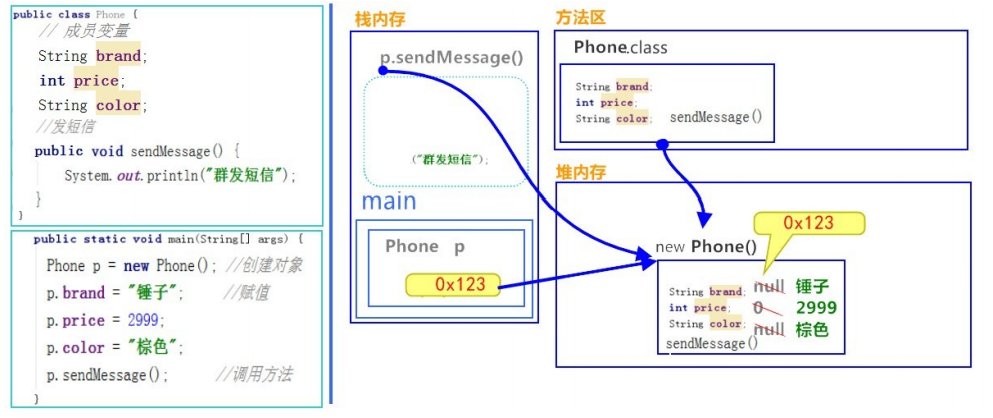

[^JAVA-Michealzou@126.com]: 

# 面向对象

# 一.面向对象的思想

## 1.面向对象的概述

​	Java语言是一种面向对象的程序设计语言，而面向对象思想是一种程序设计思想，我们在面向对象思想的指引下， 使用Java语言去设计、开发计算机程序。 这里的对象泛指现实中一切事物，每种事物都具备自己的属性和行为。面 向对象思想就是在计算机程序设计过程中，参照现实中事物，将事物的属性特征、行为特征抽象出来，描述成计算 机事件的设计思想。 它区别于面向过程思想，强调的是通过调用对象的行为来实现功能，而不是自己一步一步的去 操作实现。

- 面向过程：强调步骤；
- 面向对象：强调对象。

**特点：**面向对象思想是一种更符合我们思考习惯的思想，它可以将复杂的事情简单化，并将我们从执行者变成了指挥者。 面向对象的语言中，包含了三大基本特征，即**封装、继承和多态**。

### 1.1.类和对象

​	环顾周围，你会发现很多对象，比如桌子，椅子，同学，老师等。桌椅属于办公用品，师生都是人类。那么什么是 类呢？什么是对象呢？

#### 1.1.1.什么是类？

- **类**：是一组相关属性和行为的集合。可以看成是一类事物的模板，使用事物的属性特征和行为特征来描述该 类事物。

现实中，描述一类事物：

- **属性**：就是该事物的状态信息。 
- **行为**：就是该事物能够做什么。

#### 1.1.2.什么是对象

- **对象**：是一类事物的具体体现。对象是类的一个实例（对象并不是找个女朋友），必然具备该类事物的属性 和行为。

#### 1.1.3.面向对象和类的关系

- 类是对一类事物的描述，是**抽象的**。 
- 对象是一类事物的实例，是**具体的**。
-  类是对象的模板，对象是类的实体。


## 2.类的定义

### 2.1.事物与类的对比

实现世界的一类事物：

**属性**：事物的状态信息；	**行为**：事物能做什么。

Java用类描述事物也是如此：

**成员变量：**对应事物的**属性**； 	**成员方法**：对应事物的**行为**

### 2.2.类的定义

```
public class ClassName {
    //成员变量
    //成员方法
}
```

- **定义类：**就是定义类的成员，包括**成员变量**和**成员方法**；
- **成员变量：**和以前定义的变量几乎是一样的，只不过位置发生了改变，在类中，方法外；
- **成员方法：**和以前定义的方法几乎是一样的，只不过把static去掉。

**类的定义格式：**

```
public class Student {
    //成员变量
    String name；//姓名
    int age；//年龄
    //成员方法
    //学习的方法
    publicvoid study() {
    	System.out.println("好好学习，天天向上");
    }
    //吃饭的方法
    publicvoid eat() {
    	System.out.println("学习饿了要吃饭");
    }
}
```

## 3.对象的使用

对象的使用格式：

- 创建对象：

```
类名 对象名 = new 类名();
```

- 使用对象访问类中的成员：

```
对象名.成员变量；
对象名.成员方法()；
```

对象的使用格式举例：

```
public class Test01_Student {
	public static void main(String[] args) {
        //创建对象格式：类名 对象名 = new 类名();
        Student s = new Student();
        System.out.println("s:"+s); //cn.itcast.Student@100363
        //直接输出成员变量值
        System.out.println("姓名："+s.name); //null
        System.out.println("年龄："+s.age); //0
        System.out.println("‐‐‐‐‐‐‐‐‐‐");
        //给成员变量赋值
        s.name = "赵丽颖";
        s.age = 18;
        //再次输出成员变量的值
        System.out.println("姓名："+s.name); //赵丽颖
        System.out.println("年龄："+s.age); //18
        System.out.println("‐‐‐‐‐‐‐‐‐‐");
        //调用成员方法
        s.study(); // "好好学习，天天向上"
        s.eat(); // "学习饿了要吃饭"
	}
}
```

**成员变量的默认值：**

|              | **数据类型**                   | 默认值  |
| ------------ | ------------------------------ | ------- |
| **基本类型** | 整数（byte，short，int，long） | 0       |
|              | 浮点数（float，double）        | 0.0     |
|              | 字符（char）                   | '\u0000 |
|              | 布尔（boolean）                | false   |
| **引用类型** | 数组，类，接口                 | null    |

### 3.1.类与对象的练习

定义手机类：

```
public class Phone {
    // 成员变量
    String brand; //品牌
    int price; //价格
    String color; //颜色
    // 成员方法
    //打电话
    public void call(String name) {
    	System.out.println("给"+name+"打电话");
    }
    //发短信
    public void sendMessage() {
    	System.out.println("群发短信");
    }
}

```

定义测试类：

```
public class Test02Phone {
	public static void main(String[] args) {
        //创建对象
        Phone p = new Phone();
        //输出成员变量值
        System.out.println("品牌："+p.brand);//null
        System.out.println("价格："+p.price);//0
        System.out.println("颜色："+p.color);//null
        System.out.println("‐‐‐‐‐‐‐‐‐‐‐‐");
        //给成员变量赋值
        p.brand = "锤子";
        p.price = 2999;
        p.color = "棕色";
        //再次输出成员变量值
        System.out.println("品牌："+p.brand);//锤子
        System.out.println("价格："+p.price);//2999
        System.out.println("颜色："+p.color);//棕色
        System.out.println("‐‐‐‐‐‐‐‐‐‐‐‐");
        //调用成员方法
        p.call("紫霞");
        p.sendMessage();
        }
}


```

## 4.对象内存图

**一个对象，调用一个方法内存图**



```
通过上图，我们可以理解，在栈内存中运行的方法，遵循"先进后出，后进先出"的原则。变量p指向堆内存中
的空间，寻找方法信息，去执行该方法。
但是，这里依然有问题存在。创建多个对象时，如果每个对象内部都保存一份方法信息，这就非常浪费内存
了，因为所有对象的方法信息都是一样的。那么如何解决这个问题呢？请看如下图解。
```

**两个对象调用同一方法内存图**


```
对象调用方法时，根据对象中方法标记（地址值），去类中寻找方法信息。这样哪怕是多个对象，方法信息
只保存一份，节约内存空间。
```

**一个引用，作为参数传递到方法中内存图**


```
引用类型作为参数，传递的是地址值。
```

## 5.成员变量和局部变量的区别

变量根据定义位置的不同，我们给变量起了不同的名字。如下所示：

```
public class Car {
	String color; // 成员变量
	public void driver {
		int speed = 80 ;// 局部变量
		System.out.println("时速=" + speed + "KM/h");
	}
}
```

- **在类中定义的位置：**
  - 成员变量：类中，方法外；
  - 局部变量：方法中或者方法声明上（形参）。
- **作用范围不一样：**
  - 成员变量：类中；
  - 局部变量：方法中。
- **初始化值的不同：**
  - 成员变量：有默认值；
  - 局部变量：没有默认值，必须先定义，赋值，最后使用。
- 在内存中的位置不同：
  - 成员变量：堆中；
  - 局部变量：栈中。
- 生命周期的不同：
  - 成员变量：随着对象的创建而存在，随着对象的消失而消失；
  - 局部变量：随着方法调用而存在，随着方法调用完毕而消失。


# 二.封装

## 1.封装的概述

**概述**

面向对象编程语言是对客观世界的模拟，客观世界里成员变量都是隐藏在对象内部的，外界无法直接操作和修改。 封装可以被认为是一个保护屏障，防止该类的代码和数据被其他类随意访问。要访问该类的数据，必须通过指定的 方式。适当的封装可以让代码更容易理解与维护，也加强了代码的安全性。

**原则**

**将属性隐藏**起来，若需要访问某个属性，**提供公共方法**对其访问。

## 2.封装的步骤

1. 使用关键字private关键字来修饰成员变量；
2. 对需要访问的成员变量，提供一对getXXX()方法和setXXX()方法。

## 3.封装的操作

### 3.1.**private 的含义**

1. private是一个权限修饰符，代表最小权限；
2. 可以修饰成员变量和成员方法；
3. 被private修饰后的成员变量和成员方法只能在本类中才能访问。

****

### 3.2.private的使用格式

```
private 数据类型 变量名 ；
```

- 使用private修饰成员变量：

```
public class Student {
    private String name;
    private int age;
}
```

- 提供 getXxx 方法 / setXxx 方法，可以访问成员变量，代码如下：

```
public class Student {
    private String name;
    private int age;
    
	public void setName(String n) {
        name = n;
    }
    public String getName() {
    	return name;
    }
    public void setAge(int a) {
    	age = a;
    }
    public int getAge() {
    	return age;
    }
}
```

#### 3.2.1.封装的优化--this关键字

我们发现 setXxx 方法中的形参名字并不符合见名知意的规定，那么如果修改与成员变量名一致，是否就见名知意 了呢？代码如下：

```
public class Student {
    private String name;
    private int age;
    public void setName(String name) {
    	name = name;
    }
    public void setAge(int age) {
   	 	age = age;
    }
}
```

经过修改和测试，我们发现新的问题，成员变量赋值失败了。也就是说，在修改了 setXxx() 的形参变量名后，方 法并没有给成员变量赋值！这是由于形参变量名与成员变量名重名，导致成员变量名被隐藏，方法中的变量名，无 法访问到成员变量，从而赋值失败。所以，我们只能使用this关键字，来解决这个重名问题。

##### 3.2.1.1.this的含义

this代表所在类的当前对象的引用（地址值），即对象自己的引用。

记住 ：方法被哪个对象调用，方法中的this就代表那个对象。即谁在调用，this就代表谁。

##### 3.2.1.2.this的使用格式

```
this.成员变量名；
```

使用 this 修饰方法中的变量，解决成员变量被隐藏的问题，代码如下：

```
public class Student {
    private String name;
    private int age;
    public void setName(String name) {
        //name = name;
        this.name = name;
    }
    public String getName() {
    	return name;
    }
    public void setAge(int age) {
        //age = age;
        this.age = age;
    }
    public int getAge() {
    	return age;
    }
}
```

小贴士：方法中只有一个变量名时，默认也是使用 this 修饰，可以省略不写。

#### 3.2.2.封装的优化--构造方法

当一个对象被创建时候，构造方法用来初始化该对象，给对象的成员变量赋初始值。

 小贴士：无论你与否自定义构造方法，所有的类都有构造方法，因为Java自动提供了一个无参数构造方法， 一旦自己定义了构造方法，Java自动提供的默认无参数构造方法就会失效。

##### 3.2.2.1.构造方法的定义格式

```
修饰符 构造方法名(参数列表){
	// 方法体
}
```

构造方法的写法上，方法名与它所在的类名相同。它没有返回值，所以不需要返回值类型，甚至不需要void。使用 构造方法后，代码如下：

```
public class Student {
    private String name;
    private int age;
    // 无参数构造方法
    public Student() {}
    // 有参数构造方法
    public Student(String name,int age) {
        this.name = name;
        this.age = age;
    }
}
```

**注意事项**

-  如果你不提供构造方法，系统会给出无参数构造方法。
-  如果你提供了构造方法，系统将不再提供无参数构造方法。
- 构造方法是可以重载的，既可以定义参数，也可以不定义参数。

### 3.3.标准代码--JavaBean

JavaBean 是 Java语言编写类的一种标准规范。符合 JavaBean 的类，要求类必须是具体的和公共的，并且具有无 参数的构造方法，提供用来操作成员变量的 set 和 get 方法。

```
public class ClassName{
    //成员变量
    //构造方法
    //无参构造方法【必须】
    //有参构造方法【建议】
    //成员方法
    //getXxx()
    //setXxx()
}
```

编写符合 JavaBean 规范的类，以学生类为例，标准代码如下：

```
public class Student {
    //成员变量
    private String name;
    private int age;
    //构造方法
    public Student() {}
    public Student(String name,int age) {
        this.name = name;
        this.age = age;
    }
    //成员方法
    publicvoid setName(String name) {
   	 	this.name = name;
    }
    public String getName() {
    	return name;
    }
    publicvoid setAge(int age) {
    	this.age = age;
    }
    publicint getAge() {
    	return age;
    }
}
```

测试类：

```
public class TestStudent {
    public static void main(String[] args) {
        //无参构造使用
        Student s= new Student();
        s.setName("柳岩");
        s.setAge(18);
        System.out.println(s.getName()+"‐‐‐"+s.getAge());
        public class TestStudent {
        public static void main(String[] args) {
            //无参构造使用
            Student s= new Student();
            s.setName("柳岩");
            s.setAge(18);
            System.out.println(s.getName()+"‐‐‐"+s.getAge());
	}
}
```

## 4.构造代码块和局部代码块

### 4.1.构造代码块

- 在类的内部，方法外部，的代码块。
- 通常用于抽取构造方法中的共性代码。
-  每次调用构造方法前都会调用构造代码块
-  优先于构造方法加载

```
class c{

       String country;
       {
              country="中国";
       }
       
       public c() {
              System.out.println("1号选手，来自"+country);
       }

       public c(int a) {
              System.out.println("2号选手，也来自"+country);
       }
}
```

### 4.2.局部代码块

- 在方法里面的代码块
- 通常用于控制变量的作用范围，出了括号就失效
-  变量的范围越小越好，成员变量会有线程安全问题
- 总结：执行顺序：构造代码块是最优先的，局部代码块顺序执行

### 4.3.练习：代码块的执行顺序

```
public class TT {

       public static void main(String[] args) {
              Student s = new Student();
              s.init();
       }
}

class Student{

       {
              System.out.println("构造代码块1");
       }

       public void init(){

              {
                     System.out.println("局部代码块");
              }
       }

       {
              System.out.println("构造代码块2");
       }
}
```


# 三.API

## 1.概述

API(Application Programming Interface)，应用程序编程接口。Java API是一本程序员的 字典 ，是JDK中提供给 我们使用的类的说明文档。这些类将底层的代码实现封装了起来，我们不需要关心这些类是如何实现的，只需要学 习这些类如何使用即可。所以我们可以通过查询API的方式，来学习Java提供的类，并得知如何使用它们。

## 2.API的使用步骤

- 打开API文档；
- 点击显示，找到索引，看到输入框；
- 在输入框中输入你想要查找的类或接口，然后回车；
- 观察包，java.lang下的类都不需要导包，其他的都需要导包；
- 看类的解释和说明；
- 看构造方法；
- 使用成员方法。

## 3.Scanner类

### 3.1.什么是Scanner类

一个可以解析基本类型和字符串的简单文本扫描器。 例如，以下代码使用户能够从 System.in 中读取一个数：

```
Scanner sc = new Scanner(System.in);
int i = sc.nextInt();
// System.in 系统输入指的是通过键盘录入数据
```

### 3.2.引用类型的使用步骤

- **导包**

```
import 包名.类名;
```

举例：

```
java.util.Scanner;
```

- **创建对象**

使用该类的构造方法，创建一个该类的对象。 格式：

```
数据类型 变量名 = new 数据类型(参数列表);
```

举例：

```
Scanner sc = new Scanner(System.in);
```

- **调用方法**

调用该类的成员方法，完成指定功能。 格式：

```
变量名.方法名();
```

举例：

```
int i = sc.nextInt(); // 接收一个键盘录入的整数
```

### 3.3.Scanner类的使用步骤

- 查看类

```
java.util.Scanner ：该类需要import导入后使用。
```

- 查看构造方法

```
public Scanner(InputStream source) : 构造一个新的 Scanner ，它生成的值是从指定的输入流扫描的。
```

- 查看成员方法

```
public int nextInt() ：将输入信息的下一个标记扫描为一个 int 值。
```

使用Scanner类，完成接收键盘录入数据的操作，代码如下：

```
//1. 导包
import java.util.Scanner;
public class Demo01_Scanner {
    public static void main(String[] args) {
        //2. 创建键盘录入数据的对象
        Scanner sc = new Scanner(System.in);
        //3. 接收数据
        System.out.println("请录入一个整数：");
        int i = sc.nextInt();
        //4. 输出数据
        System.out.println("i:"+i);
    }
}
```

### 3.4.练习1：求和

```
import java.util.Scanner;
public class Test01Scanner {
	public static void main(String[] args) {
        // 创建对象
        Scanner sc = new Scanner(System.in);
        // 接收数据
        System.out.println("请输入第一个数据：");
        int a = sc.nextInt();
        System.out.println("请输入第二个数据：");
        int b = sc.nextInt();
        // 对数据进行求和
        int sum = a + b;
        System.out.println("sum:" + sum);
	}
}
```

### 3.5.练习2：求最大值

```
import java.util.Scanner;
public class Test02Scanner {
    public static void main(String[] args) {
        // 创建对象
        Scanner sc = new Scanner(System.in);
        // 接收数据
        System.out.println("请输入第一个数据：");
        int a = sc.nextInt();
        System.out.println("请输入第二个数据：");
        int b = sc.nextInt();
        System.out.println("请输入第三个数据：");
        int c = sc.nextInt();
        // 如何获取三个数据的最大值
        int temp = (a > b ? a : b);
        int max = (temp > c ? temp : c);
        System.out.println("max:" + max);
    }
}

```

## 4.Random类

### 4.1.什么是Random类

此类的实例用于生成伪随机数。 例如，以下代码使用户能够得到一个随机数：

```
Random r = new Random();
int i = r.nextInt();
```

### 4.2.Random类的使用步骤

- 查看类

```
java.util.Random ：该类需要 import导入使后使用。
```

- 查看构造方法

```
public Random() ：创建一个新的随机数生成器。
```

- 查看成员方法

```
public int nextInt(int n) ：返回一个伪随机数，范围在 0 （包括）和 指定值 n （不包括）之间的
int 值。
```

使用Random类，完成生成3个10以内的随机整数的操作，代码如下：

```
//1. 导包
import java.util.Random;
public class Demo01_Random {
    public static void main(String[] args) {
        //2. 创建键盘录入数据的对象
        Random r = new Random();
        for(int i = 0; i < 3; i++){
        //3. 随机生成一个数据
        int number = r.nextInt(10);
        //4. 输出数据
        System.out.println("number:"+ number);
        }
    }
}

```

**备注：创建一个 Random 对象，每次调用 nextInt() 方法，都会生成一个随机数。**

### 4.3.练习1：获取随机数

```
//	获取1-n之间的随机数，包含n
// 导包
import java.util.Random;
public class Test01Random {
    public static void main(String[] args) {
        int n = 50;
        // 创建对象
        Random r = new Random();
        // 获取随机数
        int number = r.nextInt(n) + 1;
        // 输出随机数
        System.out.println("number:" + number);
    }
}
```

### 4.4.练习2:猜数字

```
// 游戏开始时，会随机生成一个1-100之间的整数 number 。玩家猜测一个数字 guessNumber ，会与 number 比
// 较，系统提示大了或者小了，直到玩家猜中，游戏结束。
// 导包
import java.util.Random;
public class Test02Random {
    public static void main(String[] args) {
        // 系统产生一个随机数1‐100之间的。
        Random r = new Random();
        int number = r.nextInt(100) + 1;
        while(true){
        // 键盘录入我们要猜的数据
        Scanner sc = new Scanner(System.in);
        System.out.println("请输入你要猜的数字(1‐100)：");
        int guessNumber = sc.nextInt();
        // 比较这两个数据(用if语句)
        if (guessNumber > number) {
        	System.out.println("你猜的数据" + guessNumber + "大了");
        } else if (guessNumber < number) {
        	System.out.println("你猜的数据" + guessNumber + "小了");
        } else {
        	System.out.println("恭喜你,猜中了");
        break;
        }
        }
    }
}
```

## 5.ArrayList类

子类为数组工具类。到目前为止，我们想存储对象数据，选择的容器，只有对象数组。而数组的长度是固定的，无法适应数据变化的需 求。为了解决这个问题，Java提供了另一个容器 java.util.ArrayList 集合类,让我们可以更便捷的存储和操作对 象数据。

```
public class Student {
    private String name;
    private int age;
    public Student() {
    }
    public Student(String name, int age) {
        this.name = name;
        this.age = age;
    }
    public String getName() {
    	return name;
    }
    publicvoid setName(String name) {
    	this.name = name;
    }
    publicint getAge() {
    	return age;
    }
    publicvoid setAge(int age) {
    	this.age = age;
    }
    }
    public class Test01StudentArray {
    public static void main(String[] args) {
        //创建学生数组
        Student[] students = new Student[3];
        //创建学生对象
        Student s1 = new Student("曹操",40);
        Student s2 = new Student("刘备",35);
        Student s3 = new Student("孙权",30);
        //把学生对象作为元素赋值给学生数组
        students[0] = s1;
        students[1] = s2;
        students[2] = s3;
        //遍历学生数组
        for(int x=0; x<students.length; x++) {
            Student s = students[x];
            System.out.println(s.getName()+"‐‐‐"+s.getAge());
        }
    }
}
```

### 5.1.什么是ArrayList类

java.util.ArrayList 是大小可变的数组的实现，存储在内的数据称为元素。此类提供一些方法来操作内部存储 的元素。 ArrayList 中可不断添加元素，其大小也自动增长。

### 5.2.ArrayList类的使用步骤

- 查看类

```
java.util.ArrayList <E> ：该类需要 import导入使后使用。
```

 <E>，表示一种指定的数据类型，叫做泛型。 E ，取自Element（元素）的首字母。在出现 E 的地方，我们使 用一种引用数据类型将其替换即可，表示我们将存储哪种引用类型的元素。代码如下：

```
ArrayList<String>，ArrayList<Student>
```

- 查看构造方法

```
public ArrayList() ：构造一个内容为空的集合。
格式：
ArrayList<String> list = new ArrayList<String>();
在JDK 7后,右侧泛型的尖括号之内可以留空，但是<>仍然要写。简化格式：
ArrayList<String> list = new ArrayList<>();
```

- 查看成员方法

```
public boolean add(E e) ： 将指定的元素添加到此集合的尾部。
参数 E e ，在构造ArrayList对象时， <E> 指定了什么数据类型，那么 add(E e) 方法中，只能添加什么数据
类型的对象。
```

使用ArrayList类，存储三个字符串元素，代码如下：

```
public class Test02StudentArrayList {
    public static void main(String[] args) {
        //创建学生数组
        ArrayList<String> list = new ArrayList<>();
        //创建学生对象
        String s1 = "曹操";
        String s2 = "刘备";
        String s3 = "孙权";
        //打印学生ArrayList集合
        System.out.println(list);
        //把学生对象作为元素添加到集合
        list.add(s1);
        list.add(s2);
        list.add(s3);
        //打印学生ArrayList集合
        System.out.println(list);
    }
}
```

### 5.3.常用方法和遍历

对于元素的操作,基本体现在——增、删、查。常用的方法有：

- ```
  public boolean add(E e) ：将指定的元素添加到此集合的尾部。
  ```

- ```
  public E remove(int index) ：移除此集合中指定位置上的元素。返回被删除的元素。
  ```

- ```
  public E get(int index) ：返回此集合中指定位置上的元素。返回获取的元素。
  ```

- ```
  public int size() ：返回此集合中的元素数。遍历集合时，可以控制索引范围，防止越界。
  ```

  案例：

  ```
  public class Demo01ArrayListMethod {
      public static void main(String[] args) {
          //创建集合对象
          ArrayList<String> list = new ArrayList<String>();
          //添加元素
          list.add("hello");
          list.add("world");
          list.add("java");
          //public E get(int index):返回指定索引处的元素
          System.out.println("get:"+list.get(0));
          System.out.println("get:"+list.get(1));
          System.out.println("get:"+list.get(2));
          //public int size():返回集合中的元素的个数
          System.out.println("size:"+list.size());
          //public E remove(int index):删除指定索引处的元素，返回被删除的元素
          System.out.println("remove:"+list.remove(0));
          //遍历输出
          for(int i = 0; i < list.size(); i++){
          	System.out.println(list.get(i));
          }
      }
  }
  ```

  

### 5.4.如何存储基本类型数值

ArrayList对象不能存储基本类型，只能存储引用类型的数据。类似  不能写，但是存储基本数据类型对应的 包装类型是可以的。所以，想要存储基本类型数据， <> 中的数据类型，必须转换后才能编写，转换写法如下：

| 基本类型 | 基本类型包装类 |
| -------- | -------------- |
| byte     | Byte           |
| short    | Short          |
| int      | Integer        |
| long     | Long           |
| float    | Float          |
| double   | Double         |
| char     | Character      |
| boolean  | Boolean        |

我们发现，只有 Integer 和 Character 需要特殊记忆，其他基本类型只是首字母大写即可。那么存储基本类型数 据，代码如下：

```
public class Demo02ArrayListMethod {
    public static void main(String[] args) {
        ArrayList<Integer> list = new ArrayList<Integer>();
        list.add(1);
        list.add(2);
        list.add(3);
        list.add(4);
        System.out.println(list);
    }
}
```

### 5.5.ArrayList练习1：数值添加到集合

生成6个1~33之间的随机整数,添加到集合,并遍历

```
public class Test01ArrayList {
    public static void main(String[] args) {
    // 创建Random 对象
    Random random = new Random();
    // 创建ArrayList 对象
    ArrayList<Integer> list = new ArrayList<>();
    // 添加随机数到集合
    for (int i = 0; i < 6; i++) {
        int r = random.nextInt(33) + 1;
        list.add(r);
    	}
    	// 遍历集合输出
    for (int i = 0; i < list.size(); i++) {
        System.out.println(list.get(i));
        }
    }
}

```

### 5.6.ArrayList练习2:对象添加到集合

自定义4个学生对象,添加到集合,并遍历

```
public class Test02ArrayList {
    public static void main(String[] args) {
        //创建集合对象
        ArrayList<Student> list = new ArrayList<Student>();
        //创建学生对象
        Student s1 = new Student("赵丽颖",18);
        Student s2 = new Student("唐嫣",20);
        Student s3 = new Student("景甜",25);
        Student s4 = new Student("柳岩",19);
        //把学生对象作为元素添加到集合中
        list.add(s1);
        list.add(s2);
        list.add(s3);
        list.add(s4);
        //遍历集合
        for(int x = 0; x < list.size(); x++) {
            Student s = list.get(x);
            System.out.println(s.getName()+"‐‐‐"+s.getAge());
        }
    }
}
```

### 5.7.ArrayList练习3：打印集合方法

定义以指定格式打印集合的方法(ArrayList类型作为参数)，使用{}扩起集合，使用@分隔每个元素。格式参照 {元素 @元素@元素}。

```
public class Test03ArrayList {
    public static void main(String[] args) {
            // 创建集合对象
            ArrayList<String> list = new ArrayList<String>();
            // 添加字符串到集合中
            list.add("张三丰");
            list.add("宋远桥");
            list.add("张无忌");
            list.add("殷梨亭");
            // 调用方法
            printArrayList(list);
        }
        public static void printArrayList(ArrayList<String> list) {
            // 拼接左括号
            System.out.print("{");
            // 遍历集合
            for (int i = 0; i < list.size(); i++) {
                // 获取元素
                String s = list.get(i);
                // 拼接@符号
                if (i != list.size() ‐ 1) {
                System.out.print(s + "@");
            } else {
                // 拼接右括号
                System.out.print(s + "}");
            }
        }
    }
}
```

### 5.8.ArrayList练习4：获取集合方法

定义获取所有偶数元素集合的方法(ArrayList类型作为返回值)

```
public class Test04ArrayList {
    public static void main(String[] args) {
        // 创建Random 对象
        Random random = new Random();
        // 创建ArrayList 对象
        ArrayList<Integer> list = new ArrayList<>();
        // 添加随机数到集合
        for (int i = 0; i < 20; i++) {
            int r = random.nextInt(1000) + 1;
            list.add(r);
        }
        // 调用偶数集合的方法
        ArrayList<Integer> arrayList = getArrayList(list);
        System.out.println(arrayList);
        }
        public static ArrayList<Integer> getArrayList(ArrayList<Integer> list) {
            // 创建小集合,来保存偶数
            ArrayList<Integer> smallList = new ArrayList<>();
            // 遍历list
            for (int i = 0; i < list.size(); i++) {
                // 获取元素
                Integer num = list.get(i);
                // 判断为偶数,添加到小集合中
                if (num % 2 == 0){
                    smallList.add(num);
                }
        }
        // 返回小集合
        return smallList;
        }
}
```


## 6.String类

### 6.1.String类的概述

java.lang.String 类代表字符串。Java程序中所有的字符串文字（例如 "abc" ）都可以被看作是实现此类的实 例。 类 String 中包括用于检查各个字符串的方法，比如用于比较字符串，搜索字符串，提取子字符串以及创建具有翻 译为大写或小写的所有字符的字符串的副本。

### 6.2.String类的特点

- 字符串不变：字符串的值在创建后不能被更改。

```
String s1 = "abc";
s1 += "d";
System.out.println(s1); // "abcd"
// 内存中有"abc"，"abcd"两个对象，s1从指向"abc"，改变指向，指向了"abcd"。
```

- 因为String对象是不可变的，所以它们可以被共享。

```
String s1 = "abc";
String s2 = "abc";
// 内存中只有一个"abc"对象被创建，同时被s1和s2共享。
```

-  "abc" 等效于 char[] data={ 'a' , 'b' , 'c' } 。

```
例如：
String str = "abc";
相当于：
char data[] = {'a', 'b', 'c'};
String str = new String(data);
// String底层是靠字符数组实现的。
```

### 6.3.String类的使用步骤

- 查看类：java.lang.String ：此类不需要导入。

- 查看构造方法

  - public String() ：初始化新创建的 String对象，以使其表示空字符序列。
  - public String(char[] value) ：通过当前参数中的字符数组来构造新的String。
  - public String(byte[] bytes) ：通过使用平台的默认字符集解码当前参数中的字节数组来构造新的 String。
  - 构造举例，代码如下：

  ```
  // 无参构造
  String str = new String（）；
  // 通过字符数组构造
  char chars[] = {'a', 'b', 'c'};
  String str2 = new String(chars);
  // 通过字节数组构造
  byte bytes[] = { 97, 98, 99 };
  String str3 = new String(bytes);
  ```

  

  ### 6.4.常用方法

  **public boolean equals (Object anObject) ：**将此字符串与指定对象进行比较。

  **public boolean equalsIgnoreCase (String anotherString)** ：将此字符串与指定对象进行比较，忽略大小 写。

  **public int length ()** ：返回此字符串的长度。

  **public String concat (String str)** ：将指定的字符串连接到该字符串的末尾。

  **public char charAt (int index)** ：返回指定索引处的 char值。

  **public int indexOf (String str)** ：返回指定子字符串第一次出现在该字符串内的索引。

  **public String substring (int beginIndex)** ：返回一个子字符串，从beginIndex开始截取字符串到字符 串结尾。

  **public String substring (int beginIndex)** ：返回一个子字符串，从beginIndex开始截取字符串到字符 串结尾。

  **public String substring (int beginIndex)** ：返回一个子字符串，从beginIndex开始截取字符串到字符 串结尾。

  **public String substring (int beginIndex)** ：返回一个子字符串，从beginIndex开始截取字符串到字符 串结尾。

  **public String[] split(String regex)** ：将此字符串按照给定的regex（规则）拆分为字符串数组。、

  ### 6.5.String练习1：拼接字符串

  定义一个方法，把数组{1,2,3}按照指定个格式拼接成一个字符串。格式参照如下：[word1#word2#word3]

  ```
  public class StringTest1 {
      public static void main(String[] args) {
          //定义一个int类型的数组
          int[] arr = {1, 2, 3};
          //调用方法
          String s = arrayToString(arr);
          //输出结果
          System.out.println("s:" + s);
          }
          /*
          * 写方法实现把数组中的元素按照指定的格式拼接成一个字符串
          * 两个明确：
          * 返回值类型：String
          * 参数列表：int[] arr
          */
      public static String arrayToString(int[] arr) {
          // 创建字符串s
          public class StringTest1 {
          public static void main(String[] args) {
          //定义一个int类型的数组
          int[] arr = {1, 2, 3};
          //调用方法
          String s = arrayToString(arr);
          //输出结果
          System.out.println("s:" + s);
        }
          /*
          * 写方法实现把数组中的元素按照指定的格式拼接成一个字符串
          * 两个明确：
          * 返回值类型：String
          * 参数列表：int[] arr
          */
       public static String arrayToString(int[] arr) {
          // 创建字符串s
          String s = new String("[");
          // 遍历数组，并拼接字符串
          for (int x = 0; x < arr.length; x++) {
          	if (x == arr.length ‐ 1) {
          		s = s.concat(arr[x] + "]");
          	} else {
          		s = s.concat(arr[x] + "#");
          	}
          }
          return s;
        }
      }
  
  ```

  ### 6.6.String类2：统计字符个数

  键盘录入一个字符，统计字符串中大小写字母及数字字符个

```
public class StringTest2 {
    public static void main(String[] args) {
        //键盘录入一个字符串数据
        Scanner sc = new Scanner(System.in);
        System.out.println("请输入一个字符串数据：");
        String s = sc.nextLine();
        //定义三个统计变量，初始化值都是0
        int bigCount = 0;
        int smallCount = 0;
        int numberCount = 0;
        //遍历字符串，得到每一个字符
        for(int x=0; x<s.length(); x++) {
            char ch = s.charAt(x);
            //拿字符进行判断
            if(ch>='A'&&ch<='Z') {
            	bigCount++;
            }else if(ch>='a'&&ch<='z') {
            	smallCount++;
            }else if(ch>='0'&&ch<='9') {
            	numberCount++;
            }else {
            	System.out.println("该字符"+ch+"非法");
            }
        }
        //输出结果
        System.out.println("大写字符："+bigCount+"个");
        System.out.println("小写字符："+smallCount+"个");
        System.out.println("数字字符："+numberCount+"个");
    }
}
```


## 7.static关键字

### 7.1.static的概述

关于 static 关键字的使用，它可以用来修饰的成员变量和成员方法，被修饰的成员是属于类的，而不是单单是属 于某个对象的。也就是说，既然属于类，就可以不靠创建对象来调用了。

### 7.2.定义和使用格式

#### 7.2.1.类变量

当 static 修饰成员变量时，该变量称为类变量。该类的每个对象都共享同一个类变量的值。任何对象都可以更改 该类变量的值，但也可以在不创建该类的对象的情况下对类变量进行操作。

- 类变量

```
static 数据类型 变量名；
// 例子
static int numberID；
```

比如说，基础班新班开班，学员报到。现在想为每一位新来报到的同学编学号（sid），从第一名同学开始，sid为 1，以此类推。学号必须是唯一的，连续的，并且与班级的人数相符，这样以便知道，要分配给下一名新同学的学 号是多少。这样我们就需要一个变量，与单独的每一个学生对象无关，而是与整个班级同学数量有关。

 所以，我们可以这样定义一个静态变量numberOfStudent，代码如下：

```
public class Student {
    private String name;
    private int age;
    // 学生的id
    private int sid;
    // 类变量，记录学生数量，分配学号
    public static int numberOfStudent = 0;
    public Student(String name, int age){
        this.name = name;
        this.age = age;
        // 通过 numberOfStudent 给学生分配学号
        this.sid = ++numberOfStudent;
       }
        // 打印属性值
     public void show() {
        System.out.println("Student : name=" + name + ", age=" + age + ", sid=" + sid );
    }
}
```

```
public class StuDemo {
    public static void main(String[] args) {
        Student s1 = new Student("张三", 23);
        Student s2 = new Student("李四", 24);
        Student s3 = new Student("王五", 25);
        Student s4 = new Student("赵六", 26);
        s1.show(); // Student : name=张三, age=23, sid=1
        s2.show(); // Student : name=李四, age=24, sid=2
        s3.show(); // Student : name=王五, age=25, sid=3
        s4.show(); // Student : name=赵六, age=26, sid=4
    }
}
```

#### 7.2.2.静态方法

当 static 修饰成员方法时，该方法称为类方法 。静态方法在声明中有 static ，建议使用类名来调用，而不需要 创建类的对象。调用方式非常简单。

- **类方法：**使用 static关键字修饰的成员方法，习惯称为**静态方法**。

```
修饰符 static 返回值类型 方法名 (参数列表){
	// 执行语句
}
// 例子
public static void showNum() {
	System.out.println("num:" + numberOfStudent);
}
```

- 静态方法调用的注意事项：

  - 静态方法可以直接访问类变量和静态方法。
  - 静态方法不能直接访问普通成员变量或成员方法。反之，成员方法可以直接访问类变量或静态方法。
  - 静态方法中，不能使用this关键字。

  小贴士：静态方法只能访问静态成员。

#### 7.2.3.调用格式

被static修饰的成员可以并且建议通过类名直接访问。虽然也可以通过对象名访问静态成员，原因即多个对象均属 于一个类，共享使用同一个静态成员，但是不建议，会出现警告信息。

```
// 访问类变量
类名.类变量名；
// 调用静态方法
类名.静态方法名(参数)；
// 例子
public class StuDemo2 {
    public static void main(String[] args) {
        // 访问类变量
        System.out.println(Student.numberOfStudent);
        // 调用静态方法
        Student.showNum();
    }
}
```

### 7.3. 静态原理图解

static 修饰的内容：

- 是随着类的加载而加载的，且只加载一次。
- 存储于一块固定的内存区域（静态区），所以，可以直接被类名调用。
- 它优先于对象存在，所以，可以被所有对象共享。


### 7.4.静态代码块

静态代码块：定义在成员位置，使用static修饰的代码块{ }。

- 位置：类中方法外。
- 执行：随着类的加载而执行且执行一次，优先于main方法和构造方法的执行。

格式：

```
public class ClassName{
    static {
        // 执行语句
    }
}
```

作用：给类变量进行初始化赋值。用法演示，代码如下：

```
public class Game {
    public static int number;
    public static ArrayList<String> list;
    
    static {
        // 给类变量赋值
        number = 2;
        list = new ArrayList<String>();
        // 添加元素到集合中
        list.add("张三");
        list.add("李四");
    }
}
```

小贴士： static 关键字，可以修饰变量、方法和代码块。在使用的过程中，其主要目的还是想在不创建对象的情况 下，去调用方法。下面将介绍两个工具类，来体现static 方法的便利。

## 


## 8.Math类

### 8.1.Math类的概述

java.lang.Math 类包含用于执行基本数学运算的方法，如初等指数、对数、平方根和三角函数。类似这样的工具 类，其所有方法均为静态方法，并且不会创建对象，调用起来非常简单。

### 8.2.基本运算的方法

- public static double abs(double a) ：返回 double 值的绝对值。

  ```
  double d1 = Math.abs(‐5); //d1的值为5
  double d2 = Math.abs(5); //d2的值为5
  ```

- public static double ceil(double a) ：返回大于等于参数的最小的整数。

```
double d1 = Math.ceil(3.3); //d1的值为 4.0
double d2 = Math.ceil(‐3.3); //d2的值为 ‐3.0
double d3 = Math.ceil(5.1); //d3的值为 6.0
```

- public static double floor(double a) ：返回小于等于参数最大的整数。

```
double d1 = Math.floor(3.3); //d1的值为3.0
double d2 = Math.floor(‐3.3); //d2的值为‐4.0
double d3 = Math.floor(5.1); //d3的值为 5.0
```

- public static long round(double a) ：返回最接近参数的 long。(相当于四舍五入方法)

```
long d1 = Math.round(5.5); //d1的值为6.0
long d2 = Math.round(5.4); //d2的值为5.0
```

### 8.3.练习.，计算在 -10.8 到 5.9 之间，绝对值大于 6 或者小于 2.1 的整数有多少个？

```
public class MathTest {
    public static void main(String[] args) {
        // 定义最小值
        double min = ‐10.8;
        // 定义最大值
        double max = 5.9;
        // 定义变量计数
        int count = 0;
        // 范围内循环
        for (double i = Math.ceil(min); i <= max; i++) {
            // 获取绝对值并判断
            if (Math.abs(i) > 6 || Math.abs(i) < 2.1) {
                // 计数
                count++;
        	}
        }
        System.out.println("个数为: " + count + " 个");
    }
}
```


## 四.继承

### 1.继承的概述

继承是面向对象最显著的一个特性。

继承是从已有的类中派生出新的类，新的类能吸收已有类的数据属性和行为，并能扩展新的能力。

Java继承是使用已存在的类的定义作为基础建立新类的技术，新类的定义可以增加新的数据或新的功能，也可以用父类的功能，但不能选择性地继承父类/超类/基类。

这种技术使得复用以前的代码非常容易，能够大大缩短开发周期，降低开发费用。

**提高复用性**：只要继承父类，就能有一样的功能

```
class A extends c{  //原来的eat()拿走了   }

class B extends c{  //原来的eat()拿走了  }

class c{

    public void eat(){

       syso("eat");

    }

}
```

### 2.继承的特点

- 使用extends关键字
- 相当于子类把父类的功能复制了一份
-  java只支持单继承
- 继承可以传递（爷爷，儿子，孙子的关系）
-  不能继承父类的私有成员
-  继承多用于功能的修改，子类可以拥有父类的功能的同时，进行功能拓展
-  像是is a 的关系

### 3.继承的入门案例

```
public class TTT {

       public static void main(String[] args) {
              Zi zi = new Zi();
              zi.speak();
              System.out.println(zi.skin);
              System.out.println(zi.addr);
       }
}

class Fu{
       String skin="黄种人";
       String addr="大成都";

       public void speak(){
              System.out.println("Fu...speak()");
       }
}

//通过extends和父类发生继承关系
//所有父类的功能，子类都可以继承过来，注意不能是private的
class Zi extends Fu{
       //什么都不写，能不能把父亲的内容复制一份出来
}
```

### 4.继承方法的重写(Override)

如果子类父类中出现重名的成员方法，这时的访问是一种特殊情况，叫做**方法重写 (Override)**。

**方法重写**：子类中出现与父类一模一样的方法时（返回值类型，方法名和参数列表都相同），会出现覆盖效 果，也称为重写或者复写。声明不变，重新实现。

示例：

```
class Fu {
    public void show() {
        System.out.println("Fu show");
        }
      }
class Zi extends Fu {
        //子类重写了父类的show方法
        public void show() {
        	System.out.println("Zi show");
        }
      }
      public class ExtendsDemo05{
      public static void main(String[] args) {
            Zi z = new Zi();
            // 子类中有show方法，只执行重写后的show方法
            z.show(); // Zi show
    }
}
```

#### 4.1.重写的应用

子类可以根据需要，定义特定于自己的行为。既沿袭了父类的功能名称，又根据子类的需要重新实现父类方法，从 而进行扩展增强。比如新的手机增加来电显示头像的功能，代码如下：

```
class Phone {
    public void sendMessage(){
    	System.out.println("发短信");
    }
    public void call(){
    	System.out.println("打电话");
    }
    public void showNum(){
    	System.out.println("来电显示号码");
    }
    }
    //智能手机类
    class NewPhone extends Phone {
        //重写父类的来电显示号码功能，并增加自己的显示姓名和图片功能
        public void showNum(){
            //调用父类已经存在的功能使用super
            super.showNum();
            //增加自己特有显示姓名和图片功能
            System.out.println("显示来电姓名");
            System.out.println("显示头像");
        }
    }
    public class ExtendsDemo06 {
        public static void main(String[] args) {
        // 创建子类对象
        NewPhone np = new NewPhone()；
        // 调用父类继承而来的方法
        np.call();
        // 调用子类重写的方法
        np.showNum();
    }
}
```

小贴士：这里重写时，用到super.父类成员方法，表示调用父类的成员方法。

#### 4.2.重写的注意事项

-  子类方法覆盖父类方法，必须要保证权限大于等于父类权限。
- 子类方法覆盖父类方法，返回值类型、函数名和参数列表都要一模一样。

### 5.this和super

**父类空间优先于子类对象产生**

在每次创建子类对象时，先初始化父类空间，再创建其子类对象本身。目的在于子类对象中包含了其对应的父类空 间，便可以包含其父类的成员，如果父类成员非private修饰，则子类可以随意使用父类成员。代码体现在子类的构 造方法调用时，一定先调用父类的构造方法。理解图解如下：


#### 5.1.super和this的含义

- **super** ：代表父类的**存储空间标识**(可以理解为父亲的引用)。
- **this** ：代表**当前对象**的引用(谁调用就代表谁)。

#### 5.2.super和this的用法

- 访问成员

```
this.成员变量 ‐‐ 本类的
super.成员变量 ‐‐ 父类的
this.成员方法名() ‐‐ 本类的
super.成员方法名() ‐‐ 父类的
```

- 用法演示，代码如下：

```
class Animal {
    public void eat() {
    	System.out.println("animal : eat");
    	}
    }
    class Cat extends Animal {
        public void eat() {
        	System.out.println("cat : eat");
        }
        public void eatTest() {
            this.eat(); // this 调用本类的方法
            super.eat(); // super 调用父类的方法
    	}
    }
    public class ExtendsDemo08 {
        public static void main(String[] args) {
            Animal a = new Animal();
            a.eat();
            Cat c = new Cat();
            c.eatTest();
    	}
	}
输出结果为：
animal : eat
cat : eat
animal : eat
```

- 访问构造方法

```
this(...) ‐‐ 本类的构造方法
super(...) ‐‐ 父类的构造方法
```

子类的每个构造方法中均有默认的super()，调用父类的空参构造。手动调用父类构造会覆盖默认的super()。 super() 和 this() 都必须是在构造方法的第一行，所以不能同时出现。

## 6.this和super的区别

- his代表本类对象的引用，super代表父类对象的引用。
-  this用于区分局部变量和成员变量
-  super用于区分本类变量和父类变量
-  this.成员变量 this.成员方法() this(【参数】)代表调用本类内容
-  super.成员变量 super.成员方法() super(【参数】)，代表调用父类内容
-  this和super不可以同时出现在同一个构造方法里，他们两个只要出现都得放在第一行，同时出现的话，到底第一行放谁呢。。

## 7.重写和重载的区别

- 重载：是指同一个类中的多个方法具有相同的名字,但这些方法具有不同的参数列表,即参数的数量或参数类型不能完全相同
- 重写：是存在子父类之间的,子类定义的方法与父类中的方法具有相同的方法名字,相同的参数表和相同的返回类型
- 重写是父类与子类之间多态性的一种表现
- 重载是一类中多态性的一种表现


# 五.抽象类

## 1.抽象类的概述

父类中的方法，被它的子类们重写，子类各自的实现都不尽相同。那么父类的方法声明和方法主体，只有声明还有 意义，而方法主体则没有存在的意义了。我们把没有方法主体的方法称为抽象方法。Java语法规定，包含抽象方法 的类就是抽象类。

## 2.定义

- **抽象方法** ： 没有方法体的方法。 
- **抽象类**：包含抽象方法的类。

## 3.abstract使用格式

### 3.1.抽象方法

使用abstract修饰的方法就是抽象方法，抽象方法只有一个方法名，没有方法体。

格式：

```
修饰符 abstract 返回值类型 方法名(参数) ;
```

例子：

```
public abstract void method(int id) ;
```

### 3.2.抽象类

如果一个类中有抽象方法，那么这个类就一定是抽象类。

格式：

```
abstract class 类名 {}
```

例子：

```
public abstract class car {
	public abstract void drive();
}
```

## 4.抽象的使用

继承抽象类的子类，必须重写父类所有的方法。否则该子类也必须为抽象类。必须有子类实现父类的的抽象方法，否则，父类和子类都不能创建对象，失去了意义。

```
public class Cat extends Animal {
    public void run (){
    	System.out.println("小猫在墙头走~~~")；
    }
}
public class CatTest {
    public static void main(String[] args) {
        // 创建子类对象
        Cat c = new Cat();
        // 调用run方法
        c.run();
    }
}
输出结果：
小猫在墙头走~~~
```

此时的方法重写，是子类对父类抽象方法的完成实现，我们将这种方法重写的操作，也叫做实现方法。

## 5.注意事项

- . 抽象类不能创建对象，如果创建，编译无法通过而报错。只能创建其非抽象子类的对象。假设创建了抽象类的对象，调用抽象的方法，而抽象方法没有具体的方法体，没有意义。
- . 抽象类中，可以有构造方法，是供子类创建对象时，初始化父类成员使用的。子类的构造方法中，有默认的super()，需要访问父类构造方法。
- . 抽象类中，不一定包含抽象方法，但是有抽象方法的类必定是抽象类。未包含抽象方法的抽象类，目的就是不想让调用者创建该类对象，通常用于某些特殊的类结构设 计。
- 抽象类的子类，必须重写抽象父类中所有的抽象方法，否则，编译无法通过而报错。除非该子类也是抽象 类。假设不重写所有抽象方法，则类中可能包含抽象方法。那么创建对象后，调用抽象的方法，没有 意义。

## 6.案例：群主发红包

群主发普通红包。某群有多名成员，群主给成员发普通红包。普通红包的规则：

- 群主的一笔金额，从群主余额中扣除，平均分成n等份，让成员领取。
- 成员领取红包后，保存到成员余额中。

定义用户：

```
public class User {
// 成员变量
private String username; // 用户名
private double leftMoney; // 余额
// 构造方法
public User() { }
public User(String username, double leftMoney) {
    this.username = username;
    this.leftMoney = leftMoney;
}
// get/set方法
public String getUsername() {
	return username;
}
public void setUsername(String username) {
	this.username = username;
}
public double getLeftMoney() {
	return leftMoney;
}
public void setLeftMoney(double leftMoney) {
	this.leftMoney = leftMoney;
}
// 展示信息的方法
public void show() {
	System.out.println("用户名:"+ username +" , 余额为:" + leftMoney + "元");
	}
}
```

定义群主：

```
public class QunZhu extends User {
// 添加构造方法
public QunZhu() {
}
public QunZhu(String username, double leftMoney) {
    // 通过super 调用父类构造方法
    super(username, leftMoney);
}
/*
群主发红包，就是把一个整数的金额，分层若干等份。
1.获取群主余额,是否够发红包.
不能则返回null,并提示.
能则继续.
2.修改群主余额.
3.拆分红包.
3.1.如果能整除，那么就平均分。
3.2.如果不能整除，那么就把余数分给最后一份。
*/
public ArrayList<Double> send(int money, int count) {
    // 获取群主余额
    double leftMoney = getLeftMoney();
    if(money > leftMoney) {
    	return null;
	}
    // 修改群主余额的
    setLeftMoney(leftMoney ‐ money);
    // 创建一个集合,保存等份金额
    ArrayList<Double> list = new ArrayList<>();
    // 扩大100倍,相当于折算成'分'为单位,避免小数运算损失精度的问题
    money = money * 100;
    // 每份的金额
    int m = money / count;
    // 不能整除的余数
    int l = money % count;
    // 无论是否整除,n‐1份,都是每份的等额金额
    for (int i = 0; i < count ‐ 1; i++) {
        // 缩小100倍,折算成 '元'
        list.add(m / 100.0);
    }
    // 判断是否整除
    if (l == 0) {
        // 能整除, 最后一份金额,与之前每份金额一致
        list.add(m / 100.0);
    } else {
        // 不能整除, 最后一份的金额,是之前每份金额+余数金额
        list.add((m + l) / 100.00);
    }
    // 返回集合
    return list;
    }
}
```

定义成员：

```
public class Member extends User {
    public Member() {
    }
    public Member(String username, double leftMoney) {
    	super(username, leftMoney);
    }
    // 打开红包,就是从集合中,随机取出一份,保存到自己的余额中
    public void openHongbao(ArrayList<Double> list) {
        // 创建Random对象
        Random r = new Random();
        // 随机生成一个角标
        int index = r.nextInt(list.size());
        // 移除一个金额
        Double money = list.remove(index);
        // 直接调用父类方法,设置到余额
        setLeftMoney( money );
    }
}
```

开始发红包：

```
public class Test {
public static void main(String[] args) {
    // 创建一个群主对象
    QunZhu qz = new QunZhu("群主" , 200);
    // 创建一个键盘录入
    Scanner sc = new Scanner();
    System.out.println("请输入金额:");
    int money = sc.nextInt();
    System.out.println("请输入个数:");
    int count = sc.nextInt();
    // 发送红包
    ArrayList<Double> sendList = s.send(money,count);
    // 判断,如果余额不足
    if(sendList == null){
        System.out.println(" 余额不足...");
        return;
    }
    // 创建三个成员
    Member m = new Member();
    Member m2 = new Member();
    Member m3 = new Member();
    // 打开红包
    m.openHongbao(sendList);
    m2.openHongbao(sendList);
    m3.openHongbao(sendList);
    // 展示信息
    qz.show();
    m.show();
    m2.show();
    m3.show();
}
```

课后思考：1.如果成员的余额不为0呢，将如何处理？

​					2.如果群主想输入带小数的金额呢，将如何处理？


# 六.接口

## 1.概述

Java里面由于不允许多重继承，所以如果要实现多个类的功能，则可以通过实现多个接口来实现。

Java接口和Java[抽象类](https://baike.baidu.com/item/抽象类)代表的就是抽象类型，就是我们需要提出的抽象层的具体表现。OOP[面向对象](https://baike.baidu.com/item/面向对象)的编程，如果要提高程序的复用率，增加程序的可维护性，可扩展性，就必须是面向接口的编程，面向抽象的编程，正确地使用接口、抽象类这些太有用的抽象类型做为java结构层次上的顶层。

interface 接口名{ 代码… }

## 2.接口的特点

- 接口中都是抽象方法；
- 通过interface关键字创建接口；
- 通过implements让子类实现；
- 可以把接口理解成一个特殊的抽象类；
- 接口突破了Java单继承的局限性；
- 接口和类之间可以多实现，接口和接口之间可以多继承；
- 接口是对外暴露的规则，是一个开发规范；
- 接口提高了程序的可扩展性，降低了耦合性。

## 3.入门案例

```
public class T {

       public static void main(String[] args) {
              Zi z = new Zi();
              z.study();
              z.teach();
       }
}

interface Fu{
       public abstract void study();
       public abstract void teach();
}

//实现+重写
class Zi implements Fu{
       public void study(){
              System.out.println("Zi..study()");
       }

       public void teach(){
              System.out.println("Zi..teach()");
       }
}
```

## 4.接口的用法

### 4.1.构造方法

接口里是没有构造方法的。

在创建实现类的对象时默认的super()，是调用的默认Object的无参构造。

```
interface Fu{//定义一个接口

       public abstract void show();
       //Interfaces cannot have constructors
       /*public Fu(){
              System.out.println("Fu.Fu()");
       }*/
}
```

### 4.2.成员变量

接口里没有成员变量，都是常量。所以，你定义一个变量没有写修饰符时，默认会加上：

public static final。

```
//构造函数，成员方法，成员变量
public interface Test7_Fu {
}
interface Fu2{//定义一个接口

       //int num=10;//1,成员变量
       //static int num=10;//2,默认就是静态的
       //final static int num=10;//3,默认就是final的
       public final static int num=10;//4,默认就是public的


class Zi7 implements Fu2{
}


class Test7Demoo{
       public static void main(String[] args) {
              Zi7 z= new Zi7();
              //The final field Fu2.num cannot be assigned
              //z.num=30;//默认是final的，不能修改值
              System.out.println(z.num);
              System.out.println(Fu2.num);
       }
}
```

### 4.3.成员方法

接口里的方法，默认就都是抽象的，如果你不写明是abstract的，那会自动补齐。

例如：public abstract void save

```
//这个类用来测试接口的使用
public class Test2_UseInter {
    public static void main(String[] args) {
       //测试
//     Inter2 in = new Inter2();//3、接口不能创建对象
       Inter2 in = new Inter2Impl();
//     in.count = 20 ;//4、是最终的，The final field Inter2.count cannot be assigned
       System.out.println(  in.COUNT   );
       System.out.println(  Inter2.COUNT );//5、是静态的
       in.get();
       in.update();

    }
}

//创建接口
interface Inter2{
    //1、接口里可以有构造方法吗？   ---  不能！！
//  public Inter2() {} 

    //2、接口里可以有成员变量吗？   ---   没有！！
//public static final  int count = 10;//简写，接口会为变量自动拼接  public static final
    int COUNT = 10 ; 

    //3、接口里可以有成员方法吗？  --- 可以，但都是抽象方法！！
    //public abstract void update() ; // 简写，接口会为方法自动拼接 public abstract
    void update() ; // 简写，接口会为方法自动拼接 public abstract
    void get() ;
}
class Inter2Impl  implements  Inter2{
    @Override
    public void update() {
       System.out.println("update()...");
    }
    @Override
    public void get() {
       System.out.println("get()...");
    }
}
```

## 5.接口的多实现

之前学过，在继承体系中，一个类只能继承一个父类。而对于接口而言，一个类是可以实现多个接口的，这叫做接 口的多实现。并且，一个类能继承一个父类，同时实现多个接口。 实现格式：

```
class 类名 [extends 父类名] implements 接口名1,接口名2,接口名3... {
    // 重写接口中抽象方法【必须】
    // 重写接口中默认方法【不重名时可选】
}
```

### 5.1.案例：抽象方法

接口中，有多个抽象方法时，实现类必须重写所有抽象方法。如果抽象方法有重名的，只需要重写一次。代码如 下：

定义多个接口：

```
interface A {
    public abstract void showA();
    public abstract void show();
}
interface B {
    public abstract void showB();
    public abstract void show();
}

```

定义实现类：

```
public class C implements A,B{
    @Override
    public void showA() {
    	System.out.println("showA");
}
	@Override
    public void showB() {
   	 	System.out.println("showB");
	}
    @Override
    public void show() {
		System.out.println("show");
	}
}
```

### 5.2.案例：默认方法

接口中，有多个默认方法时，实现类都可继承使用。如果默认方法有重名的，必须重写一次。代码如下：

 定义多个接口：

```
interface A {
    public default void methodA(){}
    public default void method(){}
}
interface B {
    public default void methodB(){}
    public default void method(){}
}
```

定义实现类：

```
public class C implements A,B{
    @Override
    public void method() {
    	System.out.println("method");
    }
}
```

### 5.3.优先级问题

当一个类，既继承一个父类，又实现若干个接口时，父类中的成员方法与接口中的默认方法重名，子类就近选择执 行父类的成员方法。代码如下：

 定义接口：

```
interface A {
    public default void methodA(){
    	System.out.println("AAAAAAAAAAAA");
    }
}

```

定义父类：

```
class D {
    public void methodA(){
   		 System.out.println("DDDDDDDDDDDD");
    }
}
```

定义子类：

```
class C extends D implements A {
	// 未重写methodA方法
}

```

定义测试类：

```
public class Test {
	public static void main(String[] args) {
        C c = new C();
        c.methodA();
	2}
}
输出结果:
DDDDDDDDDDDD
```


## 6.总结

```
1、类和类的关系：继承 extends / 单继承 / 单根继承

    -- 继承的意义：为了提高代码的复用性，减少了代码的编写提高开发效率。

    -- 方法重写的意义：在不修改父类源码的前提下，在子类中重写业务，从此使用的就是重写后的功能。

       -- 要求子类的方法声明和父类一样，只要改方法体。

    -- 有了继承有了重写就产生了多态，多态的意义：为了统一程序的调用标准，标准就是父类。

    -- 多态 也就是向上转型/向上造型。

    -- 向下造型的意义：很少用，相当于想要使用子类的特殊功能，还不如直接创建子类对象简单。

    -- class A extends B

    -- 其中，A和B都是类，A是子类，B是父类，A就拥有了B的所有功能(除了私有的和构造方法)

 

    -- 其他知识点：this 和super  ，构造方法，各种代码块...

 

2、类和接口关系：实现implements  / 单实现 / 多实现

    -- class A implements B,C

    -- 其中，A是实现类,B和C是接口

    -- 要求A 可以把 B 和C 接口里的所有 抽象方法 都重写掉，否则 A 就是抽象类

    -- 接口不能创建对象

    -- 接口里没有构造方法，接口里都是常量，接口里都是抽象方法

 

3、接口和接口关系：继承extends / 单继承 / 多继承

    -- 接口的多继承的关系，打破了java单继承的局限性

    -- interface A  extends  B,C

    -- 其中，A B C 都是接口，A是子接口，同时拥有B和C接口里的所有功能

    -- class AImpl implements  A

    -- 要求AImpl需要重写A接口里的所有方法(是包含B和C接口的所有方法)，否则就是抽象类

 

4、接口和抽象类的区别！！！

    -- 相同点：都是抽象层，都不能实例化                      

    -- 不同点：

       -- 1、抽象类用abstract关键字描述，接口用interface

       -- 2、子类和抽象类之间是extends关系，实现类和接口之间是implements关系

       -- 3、抽象类中 可以  有构造方法 ，接口里 不能 出现 构造方法

       -- 4、抽象类里可以有 变量，接口里没有变量全都是静态的常量

       -- 5、接口里定义常量的语法：public static final String NAME="jack"，会为变量自动拼接public static final

       -- 6、抽象类里 可以有普通方法  也可以有 抽象方法，接口都是抽象方法

       -- 7、抽象类和子类之间是继承关系，而且java中，只支持单继承

       -- 8、接口突破了java单继承的局限性，因为接口可以多继承也可以多实现，甚至可以继承的同时多实现

       -- 9、接口的复杂用法

           -- 多继承： interface A  extends  B,C  其中A是子接口，同时拥有自己的和BC的功能

           -- 多实现： class AImpl implements M,N,O,P 其中AImpl是实现类，需要同时重写MNOP的所有抽象方法，否则就是一个抽象类

           -- 继承的同时多实现： class AImpl extends Object implements M,N 一定是先继承后实现
```


# 七.多态

## 1.多态的概述

多态指同一个实体同时具有多种形式。它是面向对象程序设计（OOP）的一个重要特征。

主要是指同一个对象，在不同时刻，代表的对象不一样，指的是对象的多种形态。

好处是可以把不同的子类对象都当作父类来看，可以屏蔽不同子类对象之间的差异，写出通用的代码，做出通用的编程，统一调用标准。

例如：水，在不同时刻可以有多种形态，包括水蒸气，冰，水。

Java怎么体现多态呢？狗有两种形态：狗和小动物

```
class Animal

class Dog extends Animal

Dog d = new Dog();//狗是狗

Animal  a=new Dog();//狗是小动物，创建了狗的对象，赋值给动物对象，这就是多态
```

## 2.多态的格式

```
父类类型 变量名 = new 子类对象；
变量名.方法名();
```

```
Fu f = new Zi();
f.method();
```

当使用多态方式调用方法时，首先检查父类中是否有该方法，如果没有，则编译错误；如果有，执行的是子类重写 后方法。 代码如下： 

定义父类：

```
public abstract class Animal {
	public abstract void eat();
}
```

定义子类：

```
class Cat extends Animal {
    public void eat() {
    	System.out.println("吃鱼");
    }
}
class Dog extends Animal {
    public void eat() {
    	System.out.println("吃骨头");
    }
}
```

定义测试类：

```
public class Test {
    public static void main(String[] args) {
        // 多态形式，创建对象
        Animal a1 = new Cat();
        // 调用的是 Cat 的 eat
        a1.eat();
        // 多态形式，创建对象
        Animal a2 = new Dog();
        // 调用的是 Dog 的 eat
        a2.eat();
    }
}

```

​	由于多态特性的支持，showAnimalEat方法的Animal类型，是Cat和Dog的父类类型，父类类型接收子类对象，当 然可以把Cat对象和Dog对象，传递给方法。 当eat方法执行时，多态规定，执行的是子类重写的方法，那么效果自然与showCatEat、showDogEat方法一致， 所以showAnimalEat完全可以替代以上两方法。 不仅仅是替代，在扩展性方面，无论之后再多的子类出现，我们都不需要编写showXxxEat方法了，直接使用 showAnimalEat都可以完成。 所以，多态的好处，体现在，可以使程序编写的更简单，并有良好的扩展。

## 3.多态的特点

- 多态的前提是继承；
- 要有方法的重写；
- 父类引用指向子类，Animal a = new Dog(); --小到大，向上转换
- 多态中，编译看左，运行看右。

**向上转型**：多态本身是子类类型向父类类型向上转换的过程，这个过程是默认的。

当父类引用指向一个子类对象时，便是向上转型。 使用格式：

```
父类类型 变量名 = new 子类类型();
如：Animal a = new Cat();
```

**向下转型：**父类类型向子类类型向下转换的过程，这个过程是强制的。

一个已经向上转型的子类对象，将父类引用转为子类引用，可以使用强制类型转换的格式，便是向下转型。 

使用格式：

```
子类类型 变量名 = (子类类型) 父类变量名;
如:Cat c =(Cat) a;
```

**为什么要转型？**

当使用多态方式调用方法时，首先检查父类中是否有该方法，如果没有，则编译错误。也就是说，不能调用子类拥 有，而父类没有的方法。编译都错误，更别说运行了。这也是多态给我们带来的一点"小麻烦"。所以，想要调用子 类特有的方法，必须做向下转型。 

转型演示，代码如下： 

定义类：

```
abstract class Animal {
    abstract void eat();
    }
class Cat extends Animal {
    public void eat() {
    	System.out.println("吃鱼");
    }
    public void catchMouse() {
    	System.out.println("抓老鼠");
    }
}
class Dog extends Animal {
    public void eat() {
    	System.out.println("吃骨头");
    }
    public void watchHouse() {
    	System.out.println("看家");
    }
}

```

测试类：

```
public class Test {
	public static void main(String[] args) {
        // 向上转型
         Animal a = new Cat();
        a.eat(); // 调用的是 Cat 的 eat
        // 向下转型
        Cat c = (Cat)a;
        c.catchMouse(); // 调用的是 Cat 的 catchMouse
    }
}

```

**转型的异常**

```
public class Test {
    public static void main(String[] args) {
        // 向上转型
        Animal a = new Cat();
        a.eat(); // 调用的是 Cat 的 eat
        // 向下转型
        Dog d = (Dog)a;
        d.watchHouse(); // 调用的是 Dog 的 watchHouse 【运行报错】
    }
}
```

​	这段代码可以通过编译，但是运行时，却报出了 ClassCastException ，类型转换异常！这是因为，明明创建了 Cat类型对象，运行时，当然不能转换成Dog对象的。这两个类型并没有任何继承关系，不符合类型转换的定义。 为了避免ClassCastException的发生，Java提供了 **instanceof** 关键字，给引用变量做类型的校验，格式如下：

```
变量名 instanceof 数据类型
如果变量属于该数据类型，返回true。
如果变量不属于该数据类型，返回false。
```

所以，转换前，我们最好先做一个判断，代码如下：

```
public class Test {
    public static void main(String[] args) {
        // 向上转型
        Animal a = new Cat();
        a.eat(); // 调用的是 Cat 的 eat
        // 向下转型
        if (a instanceof Cat){
            Cat c = (Cat)a;
            c.catchMouse(); // 调用的是 Cat 的 catchMouse
        } else if (a instanceof Dog){
            Dog d = (Dog)a;
            d.watchHouse(); // 调用的是 Dog 的 watchHouse
        }
    }
}

```


## 4.多态的好处

- 多态可以让我们不用关心某个对象到底是什么类型，就可以时使用该对象的某些方法；
- 提高了程序的可扩展性和可维护性；

```
public class Q {

       public static void main(String[] args) {
              //多态--父类引用指向子类对象
              Dog a2=new Dog();
              Cat a2 = new Cat();
              Animal2 a2 = new Dog();
              eat(a2);//传入的参数满足条件就可以，运行右面的功能
       }

//封装共性方法，不关心具体类型，只要传入的参数是子类就可以
       public static void eat(Animal2 a){
              a.eat();
       }
}
```

## 5.综合案例：笔记本电脑

笔记本电脑（laptop）通常具备使用USB设备的功能。在生产时，笔记本都预留了可以插入USB设备的USB接口， 但具体是什么USB设备，笔记本厂商并不关心，只要符合USB规格的设备都可以。 定义USB接口，具备最基本的开启功能和关闭功能。鼠标和键盘要想能在电脑上使用，那么鼠标和键盘也必须遵守 USB规范，实现USB接口，否则鼠标和键盘的生产出来也无法使用。

**案例分析：**

进行描述笔记本类，实现笔记本使用USB鼠标、USB键盘

- USB接口，包含开启功能、关闭功能
- 笔记本类，包含运行功能、关机功能、使用USB设备功能
- 鼠标类，要实现USB接口，并具备点击的方法
- 键盘类，要实现USB接口，具备敲击的方法

**案例实现：**

定义USB接口：

```
interface USB {
    void open();// 开启功能
    void close();// 关闭功能
}
```

定义鼠标类：

```
class Mouse implements USB {
    public void open() {
    	System.out.println("鼠标开启，红灯闪一闪");
    }
    public void close() {
    	System.out.println("鼠标关闭，红灯熄灭");
    }
    public void click(){
    	System.out.println("鼠标单击");
    }
}

```

定义键盘类：

```
class KeyBoard implements USB {
    public void open() {
        System.out.println("键盘开启，绿灯闪一闪");
    }
    public void close() {
   	 	System.out.println("键盘关闭，绿灯熄灭");
    }
    public void type(){
    	System.out.println("键盘打字");
    }
}

```

定义笔记本类：

```
class Laptop {
    // 笔记本开启运行功能
    public void run() {
    	System.out.println("笔记本运行");
    }
    // 笔记本使用usb设备，这时当笔记本对象调用这个功能时，必须给其传递一个符合USB规则的USB设备
    public void useUSB(USB usb) {
        // 判断是否有USB设备
        if (usb != null) {
            usb.open();
            // 类型转换,调用特有方法
            if(usb instanceof Mouse){
                Mouse m = （Mouse）usb；
                m.click();
            }else if (usb instanceof KeyBoard){
            	KeyBoard kb = (KeyBoard)usb;
            	kb.type();
        }
        	usb.close();
        }
    }
    public void shutDown() {
    	System.out.println("笔记本关闭");
    }
}
```

定义测试类：

```
public class Test {
    public static void main(String[] args) {
        // 创建笔记本实体对象
        Laptop lt = new Laptop();
        // 笔记本开启
        lt.run();
        // 创建鼠标实体对象
        Usb u = new Mouse();
        // 笔记本使用鼠标
        lt.useUSB(u);
        // 创建键盘实体对象
        KeyBoard kb = new KeyBoard();
        // 笔记本使用键盘
        lt.useUSB(kb);
        // 笔记本关闭
        lt.shutDown();
    }
}
```


# 八.final关键字

## 1.概念

- 是Java提供的关键字
- final为最终
- final可以修饰类，方法，成员变量

final的设计初衷：Java出现继承后，子类可以更改父类的功能，当父类功能不允许子类改变时，就需要用final修饰。


## 2.特点

- 被final修饰的类，不能被继承；
- 被fianl修饰的方法，不能被重写；
- 被fianl修饰的变量是个常量，不能被更改；
- 常量的定义形式：final 数据类型 常量名（通常首字母为大写）= 值。


## 3.格式

- 修饰类

```
final class 类名 {
}
```

查询API发现像 public final class String 、 public final class Math 、 public final class Scanner 等，很多我们学习过的类，都是被final修饰的，目的就是供我们使用，而不让我们所以改变其内容

- 修饰方法

```
修饰符 final 返回值类型 方法名(参数列表){
	//方法体
}
```

重写被 final 修饰的方法，编译时就会报错。

- 修饰变量

**局部变量——基本类型**。基本类型的局部变量，被final修饰后，只能赋值一次，不能再更改。代码如下：

```
public class FinalDemo1 {
    public static void main(String[] args) {
        // 声明变量，使用final修饰
        final int a;
        // 第一次赋值
        a = 10;
        // 第二次赋值
        a = 20; // 报错,不可重新赋值
        // 声明变量，直接赋值，使用final修饰
        final int b = 10;
        // 第二次赋值
        b = 20; // 报错,不可重新赋值
    }
}
```

思考:如下两种写法，哪种能通过编译？

```
final int c = 0;
    for (int i = 0; i < 10; i++) {
    	c = i;
    System.out.println(c);
}
```

```
for (int i = 0; i < 10; i++) {
    final int c = i;
    System.out.println(c);
}

```

根据 final 的定义，写法1报错！写法2，为什么通过编译呢？因为每次循环，都是一次新的变量c。这也是大家 需要注意的地方。

**局部变量——引用类型**。引用类型的局部变量，被final修饰后，只能指向一个对象，地址不能再更改。但是不影响对象内部的成员变量值的 修改，代码如下：

```
public class FinalDemo2 {
    public static void main(String[] args) {
        // 创建 User 对象
        final User u = new User();
        // 创建 另一个 User对象
        u = new User(); // 报错，指向了新的对象，地址值改变。
        // 调用setName方法
        u.setName("张三"); // 可以修改
    }
}
```

**成员变量**：成员变量涉及到初始化的问题，初始化方式有两种，只能二选一：

- 显示初始化

```
public class User {
    final String USERNAME = "张三";
    private int age;
}
```

- 构造方法初始化

```
public class User {
    final String USERNAME ;
    private int age;
    public User(String username, int age) {
        this.USERNAME = username;
        this.age = age;
    }
}
```


## 4.入门案例

```
public class P {

       public static void main(String[] args) {
              Zi d = new Zi();
              d.speak();
              System.out.println(d.name);
             d.test();
       }
}

class Fu{
//final lass Fu{//1，被final的类，不能被继承
       final String Name="欢欢";
       public final void speak(){
              System.out.println("Fu..speak()");
       }
}

class Zi extends Fu{
       /*
        //2，被final的方法，不能被重写
        * public void speak(){
              System.out.println("Fu..speak()");
       }*/

       public void test(){
//           super.name="大黄";//3，被final的变量，不能重新被赋值
              System.out.println(super.name);
       }
}
```


# 九.访问控制符

用来控制一个类，或者类中的成员的访问范围

| 修饰符    | 类   | 包   | 子类 | 任意 |
| --------- | ---- | ---- | ---- | ---- |
| public    | √    | √    | √    | √    |
| protected | √    | √    | √    |      |
| default   | √    | √    |      |      |
| private   | √    |      |      |      |


# 十.设计模式

## 1.概述

Java中有23 种设计模式，本质是面向对象设计原则的实际运用，是对类的封装性、继承性和多态性，以及类的关联关系和组合关系的充分理解。

当然，软件设计模式只是一个引导，在实际的软件开发中，必须根据具体的需求来选择。

1.  对于简单的程序，可能写一个简单的算法要比引入某种设计模式更加容易。
2. 但是对于大型项目开发或者框架设计，用设计模式来组织代码显然更好。

总体来说，设计模式分为三种：

**创建型模式，共5种：工厂方法模式，抽象工厂模式，单例模式，建造者模式，原型模式；**

**结构性模式，共7种：适配器模式，装饰器模式，代理模式，外观模式，桥接模式，组合模式，享元模式；**

**行为型模式，共11种：策略模式，模板方法模式，观察者模式，迭代子模式，责任链模式，命令模式，备忘录模式，状态模式，访问者模式，终结者模式，解释器模式。**

另外还有两种：并发型模式和线程池模式。


## 2.设计模式的六大原则

- **开闭原则**（Open Close Principle）****

开闭原则就是说**对扩展开放，对修改关闭**。在程序需要进行拓展的时候，不能去修改原有的代码，实现一个热插拔的效果。所以一句话概括就是：为了使程序的扩展性好，易于维护和升级。想要达到这样的效果，我们需要使用接口和抽象类，后面的具体设计中我们会提到这点。

- **里氏代换原则（Liskov Substitution Principle）**

里氏代换原则(Liskov Substitution Principle LSP)面向对象设计的基本原则之一。 里氏代换原则中说，任何基类可以出现的地方，子类一定可以出现。 LSP是继承复用的基石，只有当衍生类可以替换掉基类，软件单位的功能不受到影响时，基类才能真正被复用，而衍生类也能够在基类的基础上增加新的行为。里氏代换原则是对“开-闭”原则的补充。实现“开-闭”原则的关键步骤就是抽象化。而基类与子类的继承关系就是抽象化的具体实现，所以里氏代换原则是对实现抽象化的具体步骤的规范。

- **依赖倒转原则（Dependence Inversion Principle）**

这个是开闭原则的基础，具体内容：真对接口编程，依赖于抽象而不依赖于具体。

- **接口隔离原则（Interface Segregation Principle）**

这个原则的意思是：使用多个隔离的接口，比使用单个接口要好。还是一个降低类之间的耦合度的意思，从这儿我们看出，其实设计模式就是一个软件的设计思想，从大型软件架构出发，为了升级和维护方便。所以上文中多次出现：降低依赖，降低耦合。

- **迪米特法则（最少知道原则）（Demeter Principle）**

为什么叫最少知道原则，就是说：一个实体应当尽量少的与其他实体之间发生相互作用，使得系统功能模块相对独立。

- **合成复用原则（Composite Reuse Principle）**

原则是尽量使用合成/聚合的方式，而不是使用继承。

## 3.单例模式

单例模式可以说是大多数开发人员在实际中使用最多的，常见的Spring默认创建的bean就是单例模式的。

单例模式有很多好处，比如可节约系统内存空间，控制资源的使用。

其中单例模式最重要的是确保对象只有一个。

简单来说，保证一个类在内存中的对象就一个。

RunTime就是典型的单例设计，我们通过对RunTime类的分析，一窥究竟。

```
package java.lang;

public class Runtime {
    //1、创建静态的全局唯一的对象
    private static Runtime currentRuntime = new Runtime();

    //2、私有构造方法，
    /** Don't let anyone else instantiate this class */
    private Runtime() {}

//3、通过自定义的静态方法获取实例
    public static Runtime getRuntime() {
       return currentRuntime;
    }
}
```

### 3.1.饿汉式

目的：控制外界创建对象的个数只能创建1个对象

开发步骤：

1、 私有化构造方法

2、 在类的内部创建好对象

3、 对外界提供一个公共的get()，返回一个已经准备好的对象

```
//测试单例设计模式 
public class Test8_Single {

    public static void main(String[] args) {
       Single s = Single.get();
       Single s1 = Single.get();
      //get()多少次，内存中使用的都是同一个对象
       System.out.println(s);//cn.tedu.single.Single@15db9742
       System.out.println(s1);//cn.tedu.single.Single@15db9742
    }
}

class Single{
//  1、私有化构造方法，不让外界直接new
    private Single() {}

//  2、在类的内部，创建好对象
    //static ：静态只能调用静态
    static private  Single s = new Single();

//  3、对外界提供一个公共的get()，返回一个已经准备好的对象

//static是为了外界不通过对象访问而是通过类名直接方法 
    static public Single get(){
       //注意：静态只能调用静态
       return s;
    }

}
```

### 3.2.懒汉式

```
class Single{
//  1、私有化构造方法，不让外界直接new
    private Single() {}

//  2、在类的内部，创建好对象
    //static ：静态只能调用静态
    static private  Single s = null; 

//  3、对外界提供一个公共的get()，返回一个已经准备好的对象
//static是为了外界不通过对象访问而是通过类名直接方法 
synchronized  static public Single get(){
       //注意：静态只能调用静态
       if(s==null){
          s = new Single();//会有安全问题
}
       return s;
    }
}
```

[^]: 

